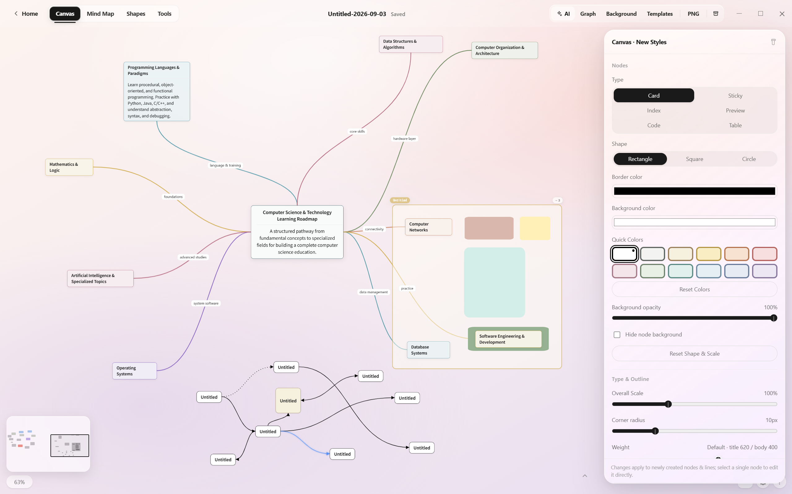
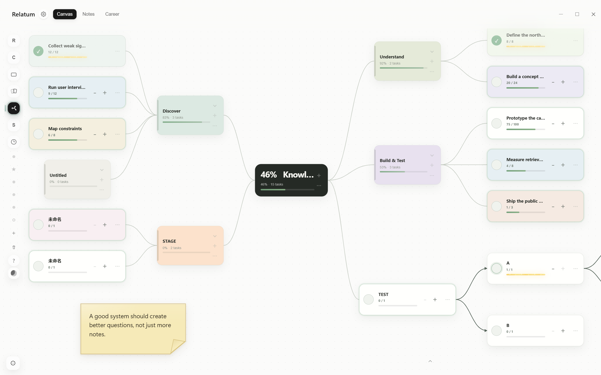
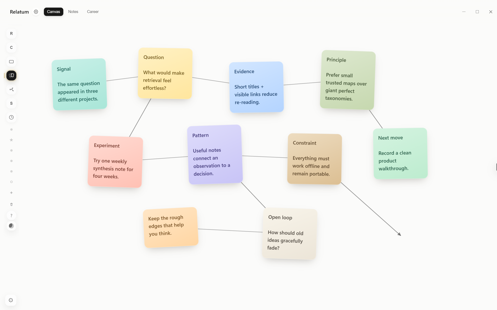
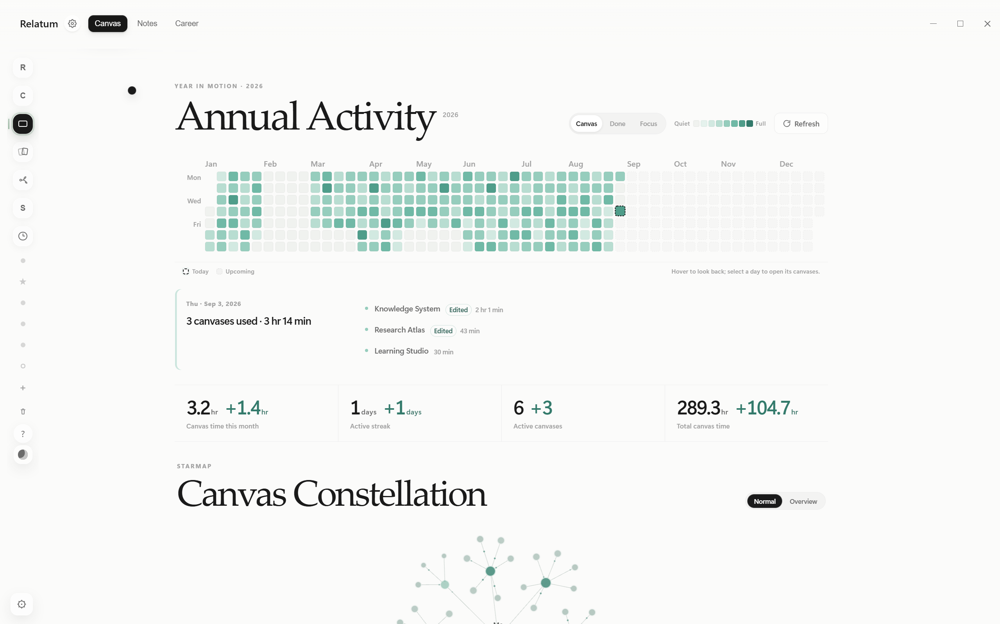
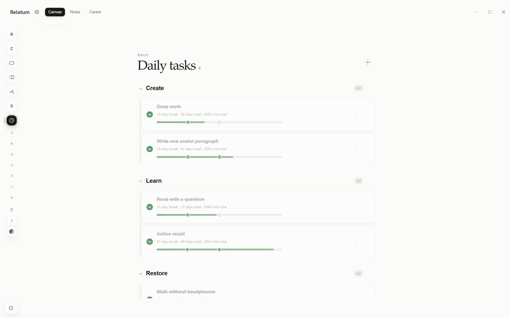
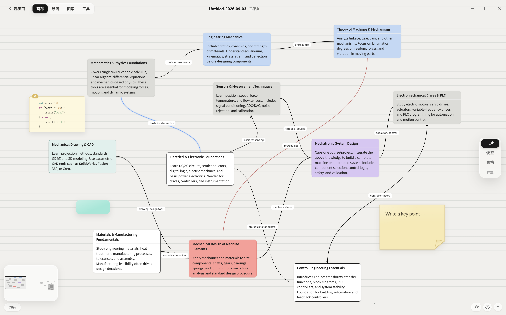
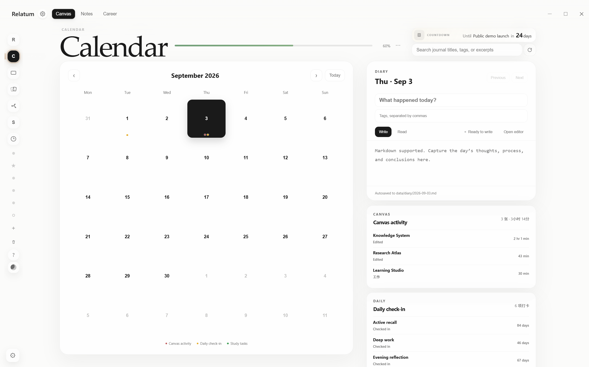

# Relatum

<p align="center">
  <strong>把零散想法放到一张自由画布上，再把它们整理成真正可用的知识。</strong>
</p>

<p align="center">
  开源、本地优先的 Windows 知识画布与学习笔记软件<br>
  适合视觉笔记、个人知识管理（PKM）、课程整理、研究构思与思维导图<br>
  界面语言：简体中文 · English
</p>

<p align="center">
  <a href="README_EN.md">English</a> ·
  <a href="https://github.com/yamibk/Relatum/releases/latest/download/Relatum-release.zip"><strong>下载 Windows 版</strong></a> ·
  <a href="https://github.com/yamibk/Relatum/releases/latest">查看最新版本</a> ·
  <a href="CONTRIBUTING.md">参与贡献</a>
</p>

<p align="center">
  <a href="https://github.com/yamibk/Relatum/releases/latest"></a>
  <a href="LICENSE"></a>
  
  
</p>

<p align="center">
  <a href="https://github.com/yamibk/Relatum/releases/latest">
    
  </a>
</p>

## Relatum 是什么？

Relatum 是一款开源、本地优先的自由知识画布和学习工作台。你可以在无限画布上自由创建节点、连接想法、整理课程笔记、阅读资料，也可以把已有内容一键排版成精美的思维导图。

它不要求注册账号，画布、偏好设置和可选的 AI 凭据默认保存在本机。Relatum 适合正在寻找本地笔记软件、无限画布、视觉化知识管理工具，或 Obsidian Canvas 兼容工作流的 Windows 用户。

## 核心能力

### 自由画布，而不是固定大纲

- 自由创建、拖动和连接节点，在同一画布上组织零散想法与复杂结构。
- 自定义节点颜色、大小、形状、圆角、透明度、字重、字号和文字对齐。
- 支持多种连线颜色、线型和路径，也可以加入手写、文字框、色块与装饰图案。
- 基础兼容 Obsidian Canvas 的 `nodes + edges` 结构。

### 一键生成精美思维导图

- 将选中的节点或整张结构一键排版为思维导图。
- 内置多套节点、配色和连线预设，并支持左右、放射、均衡等布局方向。
- 支持分支配色、层级尺寸、间距和线条样式调整。
- 保留自由编辑能力：排版后仍可移动节点、调整样式和重新组织分支。

### 笔记、阅读与资料整理

- 起步页可在“画布 / 笔记”工作区之间切换，并保留两边的当前状态。
- 内置 Obsidian 式 Markdown 笔记库：任意层级文件夹、多文档标签、可编辑文件标题、单表面 Live Preview、Callout、双链、反向链接、本地图片、词数/字符数和 350ms 无感自动保存；字体比例可在本机设置中调整。
- 文件树支持右键、内部拖动和 Windows Explorer 直接拖入；笔记与文件夹可在系统资源管理器中显示，删除走系统回收站。
- 外部改写在空闲时静默载入，与正在编辑的内容碰撞时会先写入 `data/note-recovery/` 恢复历史，不显示冲突弹窗。
- 支持 Markdown、公式、Mermaid 图表、代码、图片、PDF 和 Markdown 附件。
- 提供长文阅读、PDF/Markdown 批注、画布搜索、小地图和关系图谱。
- 支持 Markdown 文件夹导入、画布内容导出和 PNG 导出。

### 从记录到行动的学习工作台

- 番茄钟与正计时专注模式，可关联学习任务或每日任务。
- 每日任务、学习看板、日历日记、倒数日、速记墙和间隔复习。
- 独立复习卡片库，可在到期计划复习与无限随机自由复习之间切换，并用按需展开的整理模式管理内容，不依赖画布节点。
- 活跃统计、年度足迹与任务归档，让长期进度可以被看见。

### 丰富的个性化与智能工具

- 多种柔和渐变、沉浸背景与自定义图片背景。
- 自定义模板和多种预设图案，快速复用常见笔记结构。
- 可选 AI 助手支持对话、整理内容，并在确认后生成到画布。
- AI API 地址、模型和 Key 由用户配置，Key 仅保存在本机。

## 界面预览

<table>
  <tr>
    <td width="50%">
      
      <p align="center">独立目标树与渐进任务</p>
    </td>
    <td width="50%">
      
      <p align="center">速记墙与视觉关系线</p>
    </td>
  </tr>
  <tr>
    <td width="50%">
      
      <p align="center">年度活跃统计与画布星图</p>
    </td>
    <td width="50%">
      
      <p align="center">每日任务、连续记录与里程碑</p>
    </td>
  </tr>
  <tr>
    <td width="50%">
      
      <p align="center">自由画布与课程知识图谱</p>
    </td>
    <td width="50%">
      
      <p align="center">日历、日记、倒数日与每日记录</p>
    </td>
  </tr>
</table>

## 快速开始

### 下载 Windows 桌面版

1. [下载最新版 `Relatum-release.zip`](https://github.com/yamibk/Relatum/releases/latest/download/Relatum-release.zip)。
2. 将 ZIP 完整解压到一个可写目录。
3. 双击 `Relatum.exe` 进入完整模式，或双击同图标的 `RelatumLauncher.exe` 选择本次功能后启动。

支持 Windows 10/11。目标电脑需要 Microsoft Edge WebView2 Runtime，Windows 10/11 通常已经安装。

> 请不要在旧版本目录中直接覆盖更新。建议先保留旧目录中的 `data/`、`canvases/` 和 `notes/`，确认新版正常后再迁移个人数据。

### 使用资源选择启动器

`RelatumLauncher.exe` 提供 16 个开关：四个工作区、画布管理、画布编辑器、七个特殊页面，以及 AI、图谱和动态桌面背景。关闭父项会保留子项的勾选记忆，本次不加载它们。选择在点击“启动 Relatum”时原子保存到应用数据目录的 `data/launcher-profile.json`（版本 1）；取消不保存。配置损坏会提示并显示默认选择，新增功能默认启用。

默认每次打开启动器都等待用户确认。在 Relatum 的“客户端设置”中勾选“启动 RelatumLauncher 时不再弹窗”，之后双击启动器会直接按上次选择启动；取消勾选即可恢复选择窗口。此偏好独立原子保存到 `data/launcher-settings.json`（`{version:1, skipSelection:布尔值}`），不会改动功能选择。选择配置缺失或损坏时仍显示选择窗口。仅编辑器模式会复用上次确认的画布路径；文件失效时恢复选择窗口。

禁用功能不会加载脚本、初始化或预热，入口、翻页、快捷键和专属写入接口也会被限制；已启用功能保留原有预热，历史统计仍可读取其他功能的数据。发布包保留全部资源，选择只影响本次运行，禁用不会删除用户内容。

画布管理和编辑器可以分别选择。如果只保留编辑器，启动前必须选择现有 `.canvas`。已有 Relatum 主窗口时，请先退出；启动器保留当前选择并提示。直接运行 `Relatum.exe` 不读取启动器的配置；已有精简模式窗口时会提示先退出，再进入完整模式。

### 从源码运行

需要 Windows 10/11 与 Python 3.9 或更高版本。源码模式只依赖 Python 标准库：

```powershell
python app.py
```

也可以双击 `打开画布.bat`，或运行：

```powershell
powershell -ExecutionPolicy Bypass -File .\start.ps1
```

首次启动后会在应用目录创建：

- `canvases/`：用户的 `.canvas` 文件及附件。
- `notes/`：笔记工作区的 `.md` 文件、子文件夹及本地图片。
- `data/`：最近列表、学习记录、日历、窗口状态和 AI 配置等本地数据。

这三个目录已被 `.gitignore` 排除，不会进入源码仓库。完整数据边界请阅读 [隐私说明](docs/PRIVACY.md)。

## 构建 Windows 桌面版

桌面构建支持 Python 3.9–3.12。构建脚本会在临时目录创建环境，并安装固定版本的 PyWebView、PyInstaller、pystray 和 Pillow：

```powershell
powershell -ExecutionPolicy Bypass -File .\build-desktop.ps1
```

输出位于项目同级的 `Relatum-release/`，包含同图标的 `Relatum.exe`、`RelatumLauncher.exe`、各自的 `.exe.config` 和共用 `_internal/`。请分发整个目录。构建脚本不会把 `data/`、`canvases/` 或 `notes/` 打进发布包。

### 构建 Microsoft Store 包

先安装 Windows 10/11 SDK（需要其中的 `MakeAppx.exe`），然后运行：

```powershell
powershell -ExecutionPolicy Bypass -File .\build-msix.ps1
```

输出位于项目同级的 `Relatum-store/`。向合作伙伴中心上传其中的
`Relatum_<版本>_x64.msixupload`。商店安装版把画布和设置保存在
`%LOCALAPPDATA%\Relatum`；源码模式和 GitHub 便携版的数据位置保持不变。
此次启动器只用于便携版；MSIX 暂存包会排除启动器 EXE 和它的 `.exe.config`。

## 项目结构

```text
Relatum/
├─ app.py                    本地 HTTP 服务与数据 API
├─ notes_library.py          Markdown 笔记库、双链索引与路径安全层
├─ desktop.py                Windows 桌面外壳
├─ launcher.py               原生 WinForms 资源选择窗口
├─ feature_profile.py        功能依赖、会话配置与加载/访问边界
├─ windows_wallpaper.py      隔离的倒数日动态背景子进程、WorkerW 挂载与托盘生命周期
├─ assets/                   HTML、CSS、JavaScript 与运行资源
├─ packaging/                图标、字体和桌面构建辅助工具
├─ build-desktop.ps1         Windows 便携发布包构建入口
├─ build-msix.ps1            Microsoft Store MSIX 构建入口
├─ start.ps1                 源码模式启动入口
├─ AI笔记创作指南.md          外部准备画布/Markdown 笔记的参考（非运行时依赖）
└─ AGENTS.md                 架构约束与维护说明
```

## 开发与验证

启动器验证使用一次性 `RELATUM_DATA_ROOT`，不会读取真实用户库。安装桌面构建依赖后运行：

```powershell
python -m unittest tests.test_feature_profile tests.test_launcher_native tests.test_desktop_instance tests.test_windows_wallpaper tests.test_runtime_paths
node tests/feature-profile-browser.js
node tests/launcher-settings-package.js <发布目录>
node tests/launcher-package-memory.js <发布目录> <报告JSON路径> 3
```

浏览器验证使用本机已有 Playwright 和 Edge：`RELATUM_PLAYWRIGHT` 指定 Playwright 模块绝对路径，`RELATUM_EDGE_PATH` 指定 Edge EXE，`RELATUM_PYTHON` 指定 Python。打包验证直接连接实际 WebView2，覆盖普通单实例、笔记关闭保存和三次冷启动的进程树内存中位数。测量方法和结果见 [启动器验证说明](docs/launcher-verification.md)。

项目不需要 npm，也没有前端构建步骤。提交修改前至少运行：

```powershell
python -m py_compile app.py desktop.py windows_wallpaper.py packaging\make_icon.py packaging\make_font_subset.py

Get-ChildItem assets -Recurse -Filter *.js |
  Where-Object { $_.FullName -notmatch '\\vendor\\' } |
  ForEach-Object { node --check $_.FullName }

powershell -ExecutionPolicy Bypass -File .\scripts\check-public.ps1
```

制作公开 ZIP 或正式发布前，再运行：

```powershell
powershell -ExecutionPolicy Bypass -File .\scripts\check-public.ps1 -Physical
```

## 参与贡献

问题反馈、功能建议、文档改进和代码贡献都欢迎。开始前请阅读 [CONTRIBUTING.md](CONTRIBUTING.md) 和 [AGENTS.md](AGENTS.md)。

## 第三方组件与许可证

仓库内置 Mermaid、MathJax、PDF.js 和若干字体，以便离线运行。许可证和归属见 [THIRD_PARTY_NOTICES.md](THIRD_PARTY_NOTICES.md)。

Relatum 的原创源代码和文档采用 [MIT License](LICENSE)，Copyright © 2026 yamibk。第三方组件、字体与媒体素材继续适用各自的许可范围。
