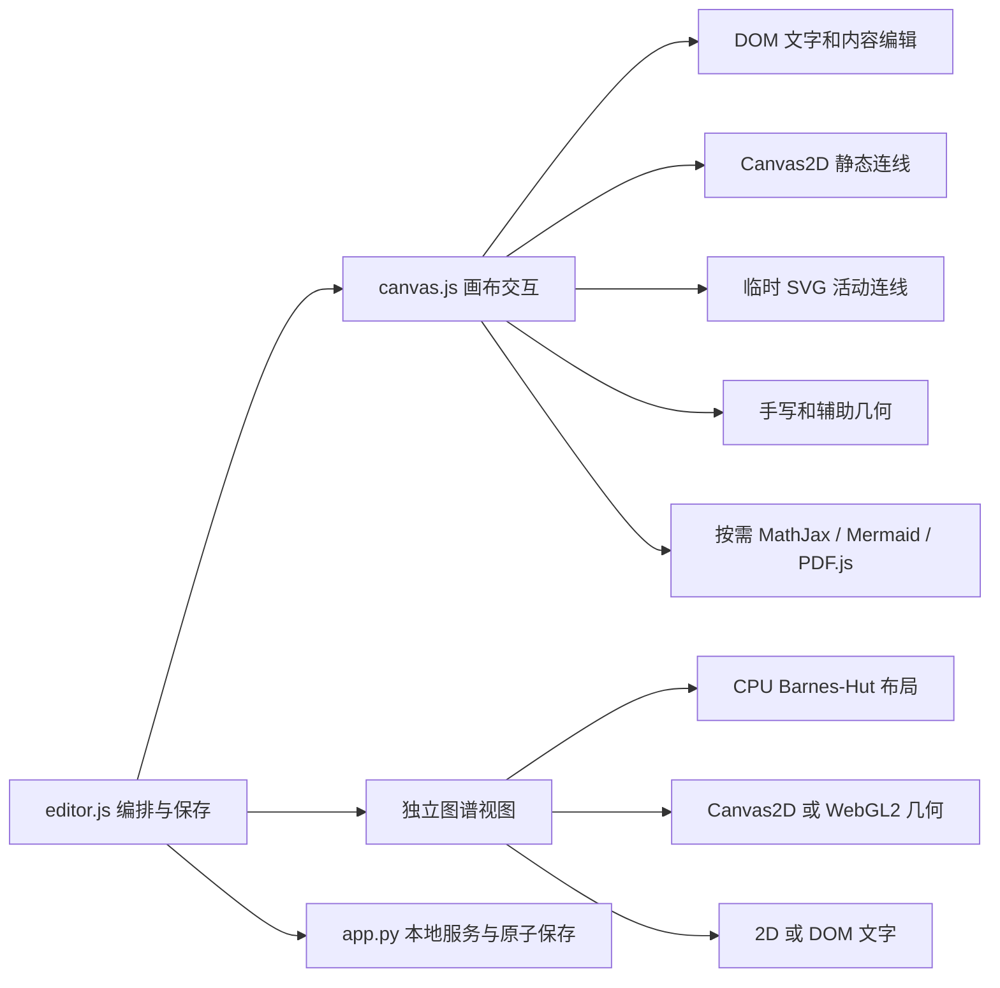
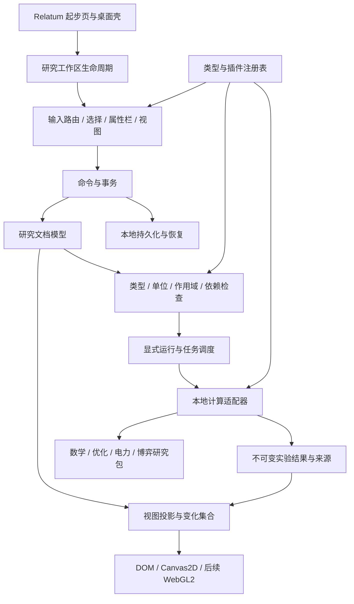
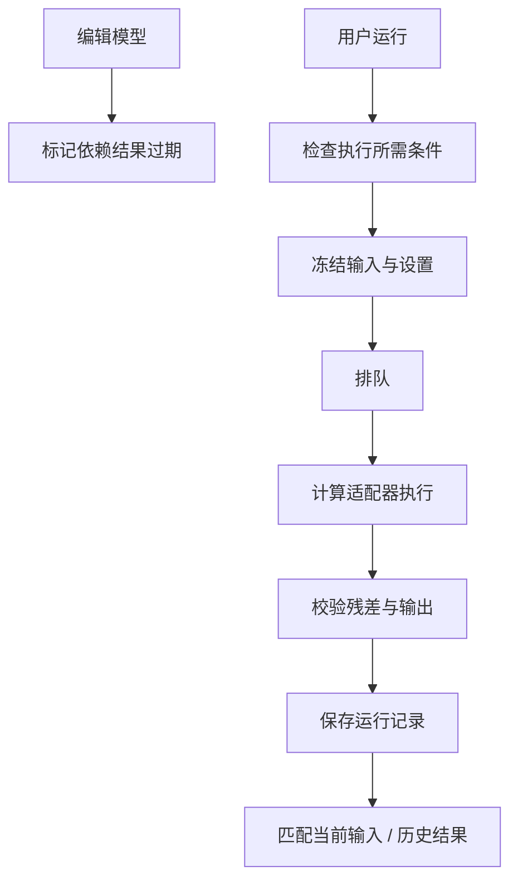

# Relatum 研究工作区总体规划

> 文档版本：0.4 · 调研与源码核对日期：2026-09-15。
>
> 定位：通用研究底座，优先服务电力系统的优化、规划、博弈与算法研究。
>
> 用途：**总体方案＋长期清单＋AI 开发接续入口**。本文首次交付只新增此文件；后续开发可按任务修改所需代码，当前状态以第 0 节为准。
>
> 暂用名称：研究 / Research；内部标识建议为 `research`，正式命名不影响数据和接口设计。

<a id="s00"></a>
## 0. 新对话从这里开工

### 0.1 最短启动提示词

```text
读《研究工作区总体规划.md》，继续开发并更新进度。
```

用户在项目目录中给出以上指令，即表示要求 agent 依据本文件和实际源码，**自行选择下一项有价值的工作，完成实现、适当验证和文档回写**。不需要用户另外解释背景、挑选清单编号或复述上一个对话。当前用户有新要求时优先执行新要求。

本文首次创建时仅交付规划；后续用户明确发送启动提示词时进入开发，当前完成范围以本节看板为准。

### 0.2 当前开发看板

**本小节是当前进度的唯一摘要。每轮开发开始核对，收尾必须更新；不要在文档不同位置维护互相冲突的进度数字。** 第 13 节记录能力状态，第 16.5 节记录执行证据，本看板负责给下一个无上下文 agent 指路。

| 字段 | 当前值 |
| --- | --- |
| 当前阶段 | M1 日常记录：Q03 普通连线与定位已完成，思维分支待接续 |
| 工作区实现 | 按需入口、单项目、变量/记录/公式、画布/对象表、普通连线、定位/适应视野、输入与命令历史、可靠保存、极简白/黑 UI |
| 当前数据/API 策略 | 研究功能处于实验期，允许破坏性调整；尚无需要长期兼容的研究格式或公共 SDK |
| 清单进度 | 88 项候选能力；V 已验收 2，W 部分实现 10；其余 76 项为 P |
| 上次完成 | Q03 第一段：普通关系创建/命名/删除、独立连线呈现、定位/适应视野与黑白主题；见第 16.5 节 |
| 正在进行 | 无在途修改；Q03 保持 W，思维分支尚未实现 |
| 默认下一项 | Q03 第二段：创建子/同级分支、基础树布局、整枝移动和折叠；保留已有普通关系 |
| 阻塞项 | 无；原生 WebView2/微软拼音与笔设备验收仍待后续阶段 |
| 数据影响 | 仅临时隔离目录产生测试项目；未修改真实画布、笔记或生涯数据。实际使用时显式创建才生成 ROOT/research/project-main/project.json |
| 最近核对 | 2026-09-15；开始开发后由实际工作的 agent 更新 |

### 0.3 当前可执行队列

Q 编号是一段可验收开发工作的编号，B/U/D/A/X 编号是长期能力编号。一个 Q 可以只完成某能力的一部分；不能完成 Q01 后就把其涉及的全部 B 条目标成 V。

| 顺序 | 工作包 | 关联能力 | 完成出口 | 状态 |
| --- | --- | --- | --- | --- |
| Q01 | 最小研究闭环：按需入口、一个项目、变量、画布/对象表、命令与保存 | B01、B02、B03、B04、B08、B10、B11、B15 的最小子集 | 同一变量两处一致；创建/改名/移动/移除呈现可撤销；保存重开；旧工作区仍能切换 | V |
| Q02 | 可持续记录：自由记录节点、公式草稿、中文输入与自动保存 | B05、B07、B16；沿用 Q01 的命令与保存 | 连续输入、合成 IME 候选、编辑内外撤销、切页/重开不丢已提交文字；真实微软拼音仍列 B16 后续验收 | V |
| Q03 | 节点与连线：普通关联、创建子/同级分支、基础树呈现、定位与适应视野 | B09、B04、B17、U07 的基础子集 | 普通连线可创建/命名/移除/撤销；分支移动和折叠不破坏其他关系；能把 Q02 草稿组织成一张可重开的思维图 | W |
| Q04 | 空间分区与手写：可嵌套分组、整组移动/折叠、笔迹与擦除 | B06、B17、U07 的基础子集 | 分组拒绝循环归属；只改变呈现；整组操作和单次笔划可撤销；隐藏时停绘 | P |

队列保持未来 2–3 个具体工作包即可，完成一项后结合实际源码滚动补充。默认先走 M0→M1→M2 的研究闭环；根据本轮用户偏好，M1 优先形成可日常使用的节点/连线/思维图和自由空间，再发展情景、推导、矩阵与专业研究。88 项清单不是固定排队顺序，也不要求先实现所有 B 条目才能做有价值的 U/D 功能。

### 0.4 agent 的执行规则

1. 先读本节、第 1.5 节、第 16 节，再读所选能力、相关架构/验收和源码；本文件是用户需要指定的唯一开发规划入口，仓库常规 `AGENTS.md` 和源码由 agent 自行定位。
2. 优先恢复实际存在的 W 工作和中断记录；核实文件与功能，不能只凭看板假设上一轮已完成或未开始。
3. 没有在途工作时，直接执行默认下一项；若源码证明它已完成、被替代或不再合适，先修正看板，再选择必要依赖已具备且最推进研究闭环的工作。
4. 简短说明本轮选择后开始实现，不停在再次规划、不询问“是否开始”，也不把技术选型题交给不熟悉技术的用户。
5. 一个工作包可拆成若干实现步骤，但应做到用户可操作或可验证的完整结果。完成后若本轮仍适合继续，就接着推进队列；避免只建空文件或只改清单就结束开发任务。
6. 改完实现并做与风险相称的验证，及时更新状态、证据和下一项。确实阻塞时记录已知原因，继续能独立推进的工作；只有缺少用户才能决定的研究路线时才用非技术语言询问。
7. 停止前留下准确接续点；用户突然中断导致未能收尾时，下个 agent 从工作目录和最后检查点恢复，不丢弃未知改动，也不把所有工作重新做一遍。

“自动推进”指这次已启动的开发任务主动完成工作与回写；它不会自行唤醒关闭的对话或在无人运行时继续开发。以后开启新对话，仍只需发送第 0.1 节的一句话。

## 阅读导航

- **先判断产品方向**：阅读 [1. 结论](#s01)、[3. 研究体验](#s03)、[12. 完整案例](#s12)、[14. 实施顺序](#s14)。
- **准备实现框架**：阅读 [4. 架构](#s04) 至 [11. 接入与兼容](#s11)，再核对 [15. 验收](#s15)。
- **选择以后开发的功能**：阅读 [13. 分层功能清单](#s13)。功能条目可以持续增加，层级不等于必须依次全部完成。
- **更换 AI 对话**：先读 [0. 开工入口](#s00)，按当前看板与 [16. 接续规则](#s16)执行；无需用户另外准备交接文档。

完整目录：

0. [新对话开工入口、当前看板与执行队列](#s00)
1. [结论与已确认方向](#s01)
2. [现有画布编辑器：能力、引擎与上限](#s02)
3. [研究者实际看到和使用的工作区](#s03)
4. [总体架构与职责边界](#s04)
5. [数学对象、关系与多视图](#s05)
6. [交互、命令、撤销与状态](#s06)
7. [渲染、布局与 CPU/GPU 性能](#s07)
8. [数学计算与研究包](#s08)
9. [存储、实验来源与恢复](#s09)
10. [插件体系与扩展接口](#s10)
11. [与 Relatum 的接入和兼容](#s11)
12. [贯穿案例：电力市场与多主体博弈](#s12)
13. [可持续扩充的分层功能清单](#s13)
14. [实施顺序与阶段出口](#s14)
15. [正确性、可靠性与性能验收](#s15)
16. [后续维护者与 AI 接续规则](#s16)
17. [架构决定与重新评估条件](#s17)
18. [来源、证据范围与术语](#s18)

<a id="s01"></a>
## 1. 结论与已确认方向

### 1.1 建议做成什么

新工作区应成为一个**能够逐步把思考变成可检查、可计算、可复现对象的研究空间**。

用户先在空白空间写问题、画图、列假设，再把需要研究的部分明确为变量、表达式、模型、算法和实验。同一对象可以在自由画布、推导链、树、数据表、网络图或实验比较中出现，背后保留同一个身份。研究深度来自这些对象的含义和可组合的计算能力。

例如，在纸面上写下“储能参与市场是否改变均衡”，可以先连接几篇文献和若干猜想；随后创建参与者、收益函数与容量约束；计算一组候选结果；看到它依赖哪组参数、哪个算法、哪些假设，以及还有什么没有得到证明。修改一个成本参数后，原结果仍保留，但会明确显示它属于旧情景。

这条路线允许高自由度，也允许逐渐严格化。**简单应当体现为规则一致、状态可解释、信息按需出现，而不是取消数学本身必要的条件。**

### 1.2 用户已经确定的选择

| 事项 | 本文采用的决定 |
| --- | --- |
| 长期定位 | 通用研究底座，电力系统优先；电气专业概念放在专业研究包中 |
| 主要流程 | 在自由空间摆放想法 → 连线与思维分支 → 明确假设/数学建模 → 检查与计算 → 比较结果 → 形成结论 |
| 主要载体 | 节点与连线、思维导图和自由空间；长篇文本作为节点详情、资料阅读与结果导出表面 |
| 输入方式 | 键盘与手写并重；识别不是手写可用的前提 |
| 数学约束介入 | 自由记录，逐步赋予含义；检查和执行时要求必要信息 |
| 发布方式 | 默认轻量本体＋可选研究包；未来可提供预装研究包的完整发行版 |
| 第一条验证案例 | 电力市场与多主体博弈 |
| 与旧工作区关系 | 独立增加工作区，保留画布、笔记、生涯 |
| 未来清单 | 不设总量上限；用户可指定方向，未指定时由 agent 按当前阶段主动推进 |
| 长期开发方式 | 用户个人长期主导，AI 跨对话接续；优先研究价值与个人维护成本 |
| 调整自由 | 允许更换技术路线、增删能力、重设结构与舍弃研究原型数据；不为假想外部开发者维持包袱 |

### 1.3 成功的判断标准

1. 不运行计算，也能顺畅记录文字、公式、手写、资料和思维分支。
2. 同一数学对象被引用多次时保持一致，改名、移动、换视图不会改变其含义。
3. 能解释结果是如何得到的，以及依赖哪些输入、条件与程序版本。
4. 专业能力可以增添，而核心工具栏、对象模型和全局状态不需要随之膨胀。
5. 某个计算包未安装或某个插件停用，已有研究记录仍能打开和导出。
6. 在实际 Windows/WebView2 环境中验证输入、资源占用与恢复行为。

### 1.4 首期边界

首期完成可持续扩展的编辑底座、基本数学对象及一条真实研究闭环。手写识别、自动证明、大规模三维、云计算、多人实时协作、通用电力市场求解不作为首期完成条件。它们在清单中保留位置，各自通过独立阶段进入。

不以一次性复制旧编辑器全部功能作为首期目标。现有优秀能力按研究价值逐项继承，优先保留记录、组织、阅读、复用与可靠保存的能力。

### 1.5 单人开发与可调整边界

**本项目长期由用户个人主导。插件化首先是为了便于本人和后续 AI 拆分、替换研究能力；第三方可以扩展是长期可能性，不是现在必须服务的开发者群体。** 不为假想的兼容用户建立多套 API、旧格式转换器、兼容层、插件市场、复杂发布流水线或团队审批流程。

采用“研究实验期”策略：

- 本文的推荐技术、模块边界、接口字段和阶段顺序都可据实际效果调整、增删或替换。agent 可以自行处理工程路线变更，并同步原因及受影响条目；不能只因为原规划写过就继续维护不合适的方案。
- 新研究工作区的原型、夹具、试验格式和可重建数据可以随实现直接修改、重建或丢弃。破坏性调整不强制编写永久兼容层，也不需要用户为每次 schema 改动重复决定。
- 在本次迭代明确选定的研究项目中，可采用一次性转换或放弃旧格式。执行前核对具体路径与影响，执行后说明哪些内容保留、转换或清除；不要把“研究数据可调整”扩展成清理原画布、笔记、生涯、无关目录或未知改动。
- 用户开始依赖某批真实研究结果、指定需要保留的数据，或决定正式对外分发时，再针对该范围增加迁移和兼容承诺。第 9、10、14、15 节的正式迁移/SDK 验收要求按这一阶段开关适用，不能提前阻塞原型开发。
- 同一支持版本中的保存、对象引用、撤销和结果来源必须正确。允许舍弃旧格式，不等于允许自动保存静默丢内容、算错数学结果或伪造实验记录。
- 功能编号是跨对话定位线索，尽量不复用；废弃功能可标 R 并保留一句原因，详细旧设计可删改。它们是进度索引，不是必须兑现的承诺。

核心只保留实际需要的抽象。先用小型注册表、明确对象类型和一个执行器验证可扩展性；在出现第二种真实实现前，不急于建立通用依赖求解器、沙箱宿主或完整 SDK。判断架构优劣的标准是：它是否让下一项真实研究能力更容易实现、检查和替换。

### 1.6 空间优先的长期方向（本轮用户确认）

用户提供了 ProjectGraph 视频的三张截图，突出“无穷嵌套”“拖拽连线旋转树”和“自动计算引擎”。这里以截图展示的交互意图为参考，未检查视频完整行为或其实现，也不据此声称 Relatum 已具备相应能力。

- **节点是日常思考的入口**：问题、假设、摘记、公式和结果先成为可摆放的对象。正文按需打开，常用操作不要求进入整页文稿。
- **自由关系与思维分支并存**：普通连线表达关联；树只管理选定的层级关系。同一对象可跨分支引用，交叉关系不会因为树布局而丢失。优先实现连续建分支、整枝拖动、重挂、折叠和稳定局部布局，再评估绕父节点旋转子树的手势。
- **嵌套空间是组织能力**：将“无穷嵌套”转化为按需深入的可嵌套分区、折叠与层级导航，不承诺无限渲染深度。禁止循环成员关系，深层结构用迭代遍历与显示预算；视觉分组与数学作用域继续分开。
- **计算从图中的明确端口生长**：长期让变量、运算和结果成为可解释的计算图。先显式运行并显示输入/错误/过期状态；以后仅对已验证、低成本、无副作用的纯运算评估自动重算。普通连线、节点距离、树枝方向不自动赋予执行语义，也不让计算默认移动用户摆好的节点。
- **空间使用感优先于长文功能扩张**：近期先把连接、选择、分支操作、视野定位、分区与保存做扎实。长文继续用于详情和论文输出，保持研究空间为主要组织界面。

这一调整改变交互优先级，不取消电力系统研究、来源追踪和可靠计算目标。Q02 先提供可连接的内容节点，Q03/Q04 接上关系和空间组织；计算阶段继续沿用第 8 节的明确执行边界。

<a id="s02"></a>
## 2. 现有画布编辑器：能力、引擎与上限

### 2.1 总体评价

现有编辑器已经是功能丰富的本地知识画布。它有完整的内容创建、阅读、批注、导图、手写、模板、资料导入和任务组织能力；大量细节围绕真实使用中的响应速度、中文编辑、撤销一致性和附件释放进行过优化。

对博士阶段研究而言，主要缺口是：**内容对象尚未形成统一的数学语义与执行协议，研究过程也尚未成为可追踪的实验系统。** 原生 JavaScript、Canvas2D 或本地 Python 服务本身并不决定理论上限。直接在现有模式和特殊节点判断上继续叠加专业规则，会使维护成本进一步上升。

以下调查依据页面入口、关键实现、独立数据模块、测试入口和维护契约交叉核对。它是源码层面的能力审查；本次未逐项启动 UI 操作，也未重新执行历史性能测试。源码入口实际位于 `assets/`，文档中常见的 `editor.html` 指 `assets/editor.html`。

### 2.2 能力清单与继承方式

继承方式含义：**复用**＝独立模块经契约核对后接入；**适配**＝提取算法或交互经验，增加新接口；**重建**＝按新语义实现；**可选**＝进入后续研究工具包。所有条目均需保留来源许可证与回归验证。

| 能力 | 当前实现与实际边界 | 主要源码入口 | 新工作区策略 |
| --- | --- | --- | --- |
| 无限画布 | 平移、锚点缩放、定位、适应视野与坐标换算 | `assets/canvas.js`：`clientToSurface`、相机相关逻辑 | 适配坐标和相机经验，形成独立服务 |
| 节点选择 | 单选、加选、框选、复制、删除、键盘导航 | `assets/canvas.js` | 重建一致的对象/视图选择规则 |
| 索引节点 | 标题、目录与阅读入口；兼容旧 `text` 类型 | `assets/canvas.js`、`assets/editor.html` | 适配为对象的紧凑呈现和引用入口 |
| 卡片/预览/便签 | 标题与正文、悬停预览、便签色等呈现差异 | `assets/canvas.js`、`assets/sticky-palette.js` | 合并到内容对象的显示模板，减少类型转换 |
| 代码节点 | 代码着色、语言选择与放大读写；未形成科研执行内核 | `assets/canvas.js`：`renderCodeNodeText` | 记录能力适配，执行能力重建 |
| Markdown | 安全结构渲染、列表、引用、任务、表格等 | `assets/markdown.js` | 复用安全渲染核心，补新工作区资源适配 |
| 局部文字格式 | 纯文字＋区间 marks，支持字号、颜色、高光等 | `assets/richtext.js` | 按需复用；不以 marks 保存数学含义 |
| 公式 | MathJax 离线按需排版，源文本触发 | `assets/canvas.js`、`assets/vendor/mathjax/` | 复用排版；计算表达与排版另建契约 |
| Mermaid | 围栏图表按需加载、统一队列 | `assets/mermaid-renderer.js` | 复用用于文档图示；不充当数学图模型 |
| 独立表格 | 二维选区、行列、粘贴、尺寸、工作室、源码往返 | `assets/markdown-table.js`、`assets/table-editor.js` | 复用网格交互，通过不同适配器处理数据 |
| 矩阵外观 | 表格可显示括号/行列式竖线并转置，真源仍为 Markdown | `assets/table-editor.js`：`transposeTableModel` | 重建数值/符号矩阵，不能把外观当运算类型 |
| 普通连线 | 多种曲线、箭头、虚实、命名、拖拐点和命中 | `assets/canvas.js` | 适配几何，语义独立重建 |
| 连接锚点 | 可连线的特殊 shape，工具状态控制显形；不参与多种内容功能 | `assets/canvas.js`：`isLinkable`、`isEdgeAnchorNode` | 用路由点和明确端口区分视觉与模型连接 |
| 思维导图 | 树判断、左右分支、布局预设、提升层级、重挂、折叠和碰撞整理 | `assets/canvas.js`：`buildManagedMindmapTree`、`applyMindmap` | 适配为层级关系的视图；不覆盖其他关系 |
| 语义分组 | 成员 ID、折叠、整体组织 | `assets/canvas.js`、`assets/canvas-import.js` | 重建为视图分组；模型作用域另外定义 |
| 盒子与形状 | 分区盒、色块、流程/学术/工程符号、叠放层级 | `assets/canvas.js`、`assets/editor.html` | 基础标注保留，专业符号由研究包赋义 |
| 手写 | 笔/荧光笔、压力/倾斜/书法、整笔与局部擦除 | `assets/canvas.js` 的 ink 逻辑 | 抽取独立笔迹层，延续输入与几何经验 |
| 文字框 | 自由排版、富文本、绑定跟随、转导图 | `assets/canvas.js`、`assets/richtext.js` | 用内容引用和呈现模板简化双重身份 |
| 直线与箭头 | 墨迹对象、端点箭头及转折点 | `assets/canvas.js` | 草稿线保留；显式提升后才具有关系含义 |
| 尺子 | 几何吸附、旋转、有限长边、节点碰撞与笔迹投影 | `assets/ruler.js`、`assets/canvas.js` | 复用纯几何部分，科研几何约束后续实现 |
| 图片 | 导入、缩放，视口驱动加载与解码资源释放 | `assets/canvas.js`、`app.py` | 适配，并支持图片区域作为资料引用 |
| PDF | 阅读、可见页渲染、文字层与多种批注 | `assets/canvas.js`、`assets/vendor/pdfjs/` | 提取阅读会话适配器，保留定位和来源 |
| Markdown 附件 | 本地阅读、文本高亮、手写/框选、指纹关联 | `assets/canvas.js`、`app.py` | 适配；明确外部变化后的引用失效 |
| 长文阅读 | 节点正文和附件的放大阅读、编辑及批注 | `assets/canvas.js`、`assets/editor.html` | 统一为对象详情表面，按需加载 |
| 搜索与小地图 | 查找、定位、几何缓存、相机变换 | `assets/canvas.js` | 适配；增加数学符号与对象类型检索 |
| 关系图谱 | 力导向关系图、交互与邻域强调 | `assets/graph-engine.js`、`assets/graph-gl.js`、`assets/graph-view.js` | 适配为一种视图；视觉距离没有数学证明含义 |
| 模板与结构组合 | 模板库、实例化、ID 重映射；组合包含研究链等结构 | `assets/canvas.js`、`assets/editor.js`、`app.py` | 复用导入思想，升级为含端口的模型模板 |
| 节点矩阵 | 按行列批量生成节点、编号、二维粘贴与布局 | `assets/node-matrix.js` | 可选批量创建工具，与数学矩阵明确区分 |
| 笔记坞 | 多页 Markdown、选区转文稿、文稿转导图 | `assets/markdown-notebook.js`、`assets/editor.js` | 复用结构解析；接入研究对象引用 |
| 镜头册 | 固定/跟随取景、排序与演示；镜头修改不入节点历史 | `assets/canvas-scenes.js`、`assets/editor.js` | 可选研究讲解与答辩演示；统一新历史规则 |
| 任务簿 | 顶级任务、成员树、叶子计时、投影、完成归档 | `assets/canvas-taskbook.js`、`assets/canvas.js` | 后续研究流程工具；不承担求解调度 |
| 计时器 | 独立正/倒计时，重新打开停止 | `assets/canvas-timer.js` | 可选辅助工具；不混入实验计时来源 |
| 双屏 | 右侧只读参考、选择复制、共享背景、单向导入 | `assets/dual-viewer.js`、`assets/dual-clipboard.js` | 适配为资料/实验比较，原始文件保留 |
| 画布合并 | 校验、深拷贝、ID/引用重映射、附件复制 | `assets/canvas-import.js`、`app.py` | 适配为旧格式导入桥 |
| 导出 | Markdown、PNG、节点归档及附件相关处理 | `assets/editor.js`、`assets/canvas.js`、`app.py` | 适配；增加数据、模型与实验清单导出 |
| 保存与历史 | 防抖串行保存、约 50 步完整快照、差异恢复 | `assets/editor.js`、`assets/canvas-changes.js` | 保存边界复用；新历史使用命令差异 |
| AI 助手 | 上下文、计划、校验、预览、确认应用、批量撤销 | `ai_plan.py`、`assets/ai-canvas-plan.js`、`assets/ai.js` | 复用受控变更思想；新协议不赋予证明权威 |
| 主题与易用性 | 纸张视觉、深色语义、语言、说明框、新手引导、低动态偏好 | `assets/editor-onboarding.js`、`assets/i18n.js`、`assets/styles.css` | 继承视觉原则，采用独立样式作用域 |

### 2.3 引擎实际结构

现有编辑器由自研原生前端组织，主要依赖并非某个通用节点编辑框架：



关键事实：

- 节点、边和相邻边有常驻 ID 索引。支持几何命中时，静态连线不需要把 SVG 路径和命中条全部挂入页面。
- 连线通过 512 画布单位的空间网格筛选候选，再做 `Path2D/isPointInStroke` 命中；拖动期间只挂载受影响的 SVG 线。能力不足时保留 SVG 回退。
- `edgePathCache` 保存路径、端点、箭头、中点与边界；相机移动不必重算所有连线几何。
- 图片、PDF、Markdown 使用视口生命周期；重资源释放与异步回写票据防止旧结果污染新对象。
- 图谱物理布局在 CPU 上计算；WebGL2 后端主要负责实例化绘制几何，不代表布局或数学求解已移到 GPU。
- `canvas.js` 仍集中承担大量交互与类型分支。虽然已经有多个无 DOM 模块，尚未形成用于第三方专业对象的统一插件协议。

来源入口：[画布核心](../assets/canvas.js)、[图谱引擎](../assets/graph-engine.js)、[WebGL 后端](../assets/graph-gl.js)、[延迟运行时](../assets/editor-lazy.js)。

### 2.4 当前复杂性的可观察来源

| 具体情形 | 已有协调成本 | 新设计原则 |
| --- | --- | --- |
| 顶栏画布/导图/图案各记忆简洁与完整状态 | 同一按键与属性栏需要考虑多层状态 | 视图只改变呈现；基础操作和创建规则稳定 |
| 同一组外观控件在无选中时改默认、选中时改对象 | 用户需要理解作用目标和默认继承 | 属性栏始终显示目标；创建模板在明确的创建入口设置 |
| 图片、文字框、表格、锚点的可连线/导图/图谱资格不同 | 类型判断散落在功能路径 | 对象能力通过类型描述符声明，关系语义独立校验 |
| 任务连线会收录成员并改变任务树 | 视觉连接可能同时触发领域行为 | 普通线默认只关联；领域操作显式命名和预览 |
| 节点、笔记坞、镜头、附件批注分别管理历史 | “撤销刚才那一步”依赖所在表面 | 新文档使用统一事务入口，文本输入保留局部编辑会话 |
| 程序通过全局模块直接修改记录 | 插件可能绕过一致性和生命周期 | 只读查询＋受控命令，执行和渲染各有接口 |

这些规则大多源于具体使用需求，并不能简单删除。重构的价值在于让同类规则由一个责任模块统一处理。

### 2.5 历史性能证据

[2026-09-05 性能报告](performance-2026-09-05.md)记录了特定 Windows、无头 Edge、1440×900、DPR 1 环境中的结果：1200/3000 节点冷启动可交互中位数约为 1.124/2.208 秒；相应场景的平移、缩放、拖动帧间隔 P95 约 17 毫秒。

这些是**报告中的历史测量**，本次没有重新测量。它们不代表当前所有场景，也不能外推到同屏大量公式、复杂图表、十万节点或实际 WebView2 的输入法体验。新工作区应继承基准方法和隔离夹具，再建立自己的测试集。

<a id="s03"></a>
## 3. 研究者实际看到和使用的工作区

### 3.1 默认界面

建议起步页显示为“画布 / 笔记 / 研究 / 生涯”。进入研究后，打开最近研究项目或空白项目；一个项目可含多个视图，不必把每个视图保存成彼此割裂的模型。

```text
Relatum   画布  笔记  研究  生涯
┌───────────────────────────────────────────────────────────────┐
│ 项目名    当前视图 ▾    搜索 / 命令         检查   运行   结果 │
├──────────┬─────────────────────────────────────┬──────────────┤
│ 项目目录 │                                     │ 当前对象     │
│ 对象搜索 │    自由研究空间                      │ 的属性与说明 │
│ 视图列表 │    文字 / 公式 / 手写 / 图表         │              │
│ 资料引用 │                                     │ 按需打开     │
├──────────┴─────────────────────────────────────┴──────────────┤
│ 保存状态                    输入反馈 / 计算状态 / 诊断入口    │
└───────────────────────────────────────────────────────────────┘
```

- 左栏可收起，负责项目、视图、检索和资料定位。
- 中央默认是节点与连线组成的自由研究空间；树是其中可切换或局部应用的组织方式。选择、连接、记录/公式、手写是基础工具；专业对象通过创建菜单与命令搜索发现。
- 右栏只有一个对象上下文；节点属性、关系含义、诊断详情在同一处出现，明确显示当前目标。
- 实验比较、代码编辑、PDF 阅读按需展开为详情表面或分屏，关闭后回到同一位置。
- 保留纸张、墨色和温和强调色；颜色同时配文字或图标说明，不承担唯一的状态编码。

### 3.2 同一对象的不同呈现

“发电商 1 的出力”可以在画布上显示为一个简洁变量，在参数/变量表中占一行，在推导中显示为 `q₁`，在结果图中成为横轴。只有一个对象 ID；字号、位置、折叠和显示精度属于各自的视图。

操作名称必须区分：

- **添加引用**：在另一处显示同一个对象。
- **复制为独立对象**：创建新身份，可单独修改。
- **从视图移除**：只移除当前呈现。
- **删除对象**：处理其引用与依赖，给出影响预览并可撤销。

复制整个模型时，内部引用重映射；指向模型外的对象继续保持外部引用，并在复制预览中列出。用户可以明确选择把外部依赖也复制成独立对象。

### 3.3 从草稿到结构化对象

1. 在空白处写下 `q1 + q2`，先保存为自由文本或公式草稿。
2. 选择“赋予数学含义”，显示识别到的符号、作用域和运算。
3. 将 `q1`、`q2` 绑定到明确变量；声明单位或保留未知。
4. 确认后生成数学表达对象，原草稿作为来源保留。
5. 需要修改数学表达时进入结构化编辑；无法解析的新输入先成为草稿，不覆盖上次有效模型。

草稿不因缺单位而禁止保存。已结构化的错误或不完整对象也可以保存；执行时阻止受影响的计算并解释缺少什么。尚未进入计算路径的自由记录不制造全屏错误提示。

### 3.4 手写与思维过程

首期手写包含原始笔迹、压力、局部擦除、选择移动和区域关联；接近文字和公式的笔迹可绑定对象区域。移动模型对象时，明确绑定的批注跟随，自由草稿保持原位。

手写识别属于后续能力包：保留原笔迹，显示识别候选，用户确认符号绑定后才生成表达。识别置信度不等于数学正确性。

“推导记录”保存选择过的路线、失败尝试、反例、待证步骤与理由。整理成一条漂亮的最终推导时，也应能返回原来的探索分支。

<a id="s04"></a>
## 4. 总体架构与职责边界

### 4.1 推荐结构

采用**模块化单体应用＋可替换计算适配器**。界面仍在现有本地应用中；专业计算按需启动独立进程。首期不增加独立常驻服务或分布式系统。



### 4.2 每层负责什么

| 层 | 负责 | 不应承担 |
| --- | --- | --- |
| 工作区壳 | 激活、切换、焦点、保存收尾、资源暂停 | 数学对象规范化、求解算法 |
| 文档核心 | 对象身份、关系、版本、命令、事务、变化订阅 | DOM、像素几何、进程管理 |
| 视图层 | 呈现引用、相机、布局、折叠与命中 | 改写变量含义、推断均衡 |
| 数学检查层 | 类型、维度、单位、符号绑定、条件与诊断 | 无条件认定未知命题真伪 |
| 调度层 | 依赖解析、输入快照、任务状态、取消、过期判定 | 解释任何任意代码的全部副作用 |
| 计算适配器 | 把明确模型转换为特定库调用并标准化输出 | 直接修改用户研究文档 |
| 存储层 | 原子保存、资源引用、修订冲突、恢复和打包 | 执行从项目加载的脚本 |
| 插件宿主 | 注册、兼容、生命周期、能力访问和错误隔离 | 允许插件取得所有内部全局对象 |

### 4.3 技术基线

- 前端：原生 ES 模块 JavaScript＋JSDoc 类型契约；运行和源码启动继续不依赖 npm 构建链。
- UI：原生 DOM/CSS，使用独立样式作用域。可复用现有 CodeMirror 离线 bundle、MathJax、PDF.js 和安全 Markdown 模块。
- 数据核心：纯函数与显式 Store，支持无 DOM 单测；不要把旧 `CanvasModule.init()` 作为新工作区的核心依赖。
- 后端：`app.py` 保留本地入口，研究持久化、调度和插件管理放入独立 Python 模块；核心仍以标准库为基线。
- 通信：复用仅监听回环地址的服务；后端与计算子进程使用私有标准输入/输出消息，日志走标准错误或结果目录。
- 分发：离线前端资产和固定版本研究包；下载、安装与使用分开。打开项目不能自动安装或执行其中声明的插件。
- 平台：先验证现有 Windows 桌面与源码模式。其他系统、商店包中的扩展分发均作为单独兼容工作，不能由“Python 可跨平台”直接推出已支持。

### 4.4 工作区生命周期接口草案

Q01 已实现 `createResearchWorkspace({host})` 的 `load / activate / flush / suspend / deactivate / dispose`。当前固定单项目，起步页沿用既有串行切换链；重复加载复用 Promise，不主动抢焦点。下例中的项目/视图参数与取消信号留待多项目阶段，不是已支持的接口。

```js
const workspace = createResearchWorkspace({ host, services });
await workspace.load({ projectId, signal });
await workspace.activate({ viewId });
await workspace.flush({ reason: 'workspace-switch' });
workspace.suspend({ reason: 'hidden' });
workspace.dispose();
```

`load` 只读数据和必要资源；`activate` 接管当前焦点与绘制；`flush` 等输入法提交及保存链完成；`suspend` 停止绘制和视图后台活动；`dispose` 取消订阅、Worker 和未使用资源。保存失败时保留文档和编辑会话，切换失败通过工作区级非遮挡提示解释。

计算任务生命周期独立：离开研究工作区默认允许已显式启动的计算继续，界面停止轮询和绘制；返回后按事件游标补齐状态。关闭应用时可等待或取消在途任务，不引入无人可见的常驻计算进程。

<a id="s05"></a>
## 5. 数学对象、关系与多视图

### 5.1 三种不同的“图”

| 图 | 节点与边的含义 | 环与方向 |
| --- | --- | --- |
| 研究关系图 | 文献、概念、猜想、证据、反例、解释及其关系 | 可有环；方向由关系类型解释 |
| 数学/领域模型 | 变量、表达式、约束、电网、参与者、状态及连接 | 电网环、互相耦合和多方约束均合法 |
| 计算依赖图 | 一次运行的输入、执行单元、产物依赖 | 调度边界默认无环；循环封装在显式迭代/求解单元中 |

它们共享对象身份，但不是一套边表的无差别解释。求解一个有环电网通常是一个执行单元，不需要按电流方向把电网拆成单向程序。

画面上的路由点、折线转角和图例只是视图几何。添加一个转角不会增加电网母线，也不会增加证明步骤。

### 5.2 对象族与最小能力

| 对象族 | 首次进入时的最小字段/能力 | 未来扩展 |
| --- | --- | --- |
| 自由记录 | 标题、Markdown/公式草稿、笔迹或资料引用 | 识别、区域提取、整理建议 |
| 符号与参数 | 稳定 ID、显示名、作用域、类型、单位、已知值或未知 | 随机变量、分布、区间与时间索引 |
| 决策变量 | 定义域、形状、单位、上下界 | 整数/布尔、半定、稀疏、复数域 |
| 表达式/函数 | 操作树、符号引用、参数绑定 | 分段、积分、微分、张量与外部算子 |
| 集合与索引 | 显式元素或有界整数范围 | 条件集合、笛卡尔积、动态索引 |
| 向量/矩阵 | 尺寸、元素类型、单位规则、值或资源引用 | 稀疏格式、算子、分块与张量 |
| 假设与命题 | 陈述、作用域、依赖、证据状态 | 逻辑量词、证明助手连接 |
| 推导步骤 | 前提 ID、结论 ID、规则/理由、适用条件 | 受控重写、反例搜索、形式证明 |
| 约束与目标 | 数学表达、适用模型、方向、单位 | 锥约束、互补、机会约束、多目标 |
| 模型/子模型 | 对象范围、公开端口、内部符号作用域 | 参数化实例、复合系统、模型库 |
| 算法 | 明确输入输出、参数、执行器与版本 | 可视迭代、收敛条件、代码生成 |
| 实验与运行 | 模型快照、情景、输入指纹、设置与产物 | 批量、分支、比较、复现包 |
| 结果与图表 | 结果引用、状态、误差/残差、图表规范 | 关联刷选、敏感性、出版样式 |
| 电力/博弈对象 | 由领域插件定义，遵循通用对象协议 | 母线、机组、玩家、收益、行动、信息集 |

类型采用命名空间，如 `core.variable`、`power.bus`、`game.player`；类型版本与项目文件版本分开。类型的“可引用”“可检查”“可运行”等能力由注册表声明，避免到处增加 `if kind === ...`。

### 5.3 关系模型

| 关系 | 语义 | 约束及默认行为 |
| --- | --- | --- |
| `core.related` | 自由关联 | 默认连接类型；不触发计算 |
| `core.contains` | 文档组织层级 | 层级本身禁止环；与数学作用域分开 |
| `core.supports / contradicts` | 支持/反驳的研究论证 | 保留来源；不自动视为证明 |
| `math.derives` | 在条件下由若干前提得到结论 | 支持多前提；每条推导独立记录检查依据 |
| `compute.binds` | 某输出绑定某输入 | 检查端口类型、维度、单位和基数 |
| `power.connects` | 电气端口连接 | 允许合法环和并联设备；领域适配器处理参数 |
| `game.acts` | 玩家在决策点采取行动 | 顺序、信息集和收益由博弈模型定义 |
| `core.cites` | 引用文献或资源区域 | 定位与源版本分开保存 |

实现上使用具有角色的 `ends[]` 表达端点，兼容两端边与多个前提。呈现上可以显示为一条边，也可显示一个关系节点连接多个端点；表达能力先于复杂 UI。

下面是关系片段；`var-q1` 与利润子模型 `model-profit-1` 及其端口由所属项目的类型描述符提供。转折点、颜色和标签位置另存于视图的关系呈现中。

```json
{
  "id": "rel-q1-profit-1",
  "type": "compute.binds",
  "typeVersion": 1,
  "ends": [
    { "role": "source", "objectId": "var-q1", "portId": "value" },
    { "role": "target", "objectId": "model-profit-1", "portId": "q1" }
  ],
  "payload": {}
}
```

端口描述包含稳定 ID、角色、接受的值类型/形状/单位和连接基数；字段未知时允许草稿绑定，运行前再校验。多前提推导使用多个 `premise` 端点和一个 `conclusion` 端点，不通过多条互不关联的线丢失“共同推出”含义。

依赖需要避免重复真源：表达式内部依赖从 AST 的符号引用派生，画面显示的依赖线是只读投影；`compute.binds` 则保存组合模型或执行单元的公开端口绑定。不能同时让一条可任意编辑的关系和 AST 各自决定同一个输入。用户通过依赖线入口换符号时，实际提交的是更新 AST/端口绑定的命令；依赖索引由此重建或增量更新。

在普通线基础上赋义时，用户明确选择关系类型；命令保留关系身份与原视觉信息并验证端点。无法成立时保留为普通关联或草稿关系，不能静默改变模型。

### 5.4 数学表达与精度

结构化表达使用受限 AST（抽象语法树），节点至少支持常量、符号引用、算子调用和显式绑定。首期运算集合从加减乘除、幂、比较、求和和选定函数开始，不自研覆盖所有数学的计算代数系统。

```json
{
  "op": "add",
  "args": [
    { "op": "symbol", "objectId": "var-q1" },
    { "op": "symbol", "objectId": "var-q2" }
  ]
}
```

此例是表达片段；两个符号 ID 由所属项目提供。可见节点仅显示整条表达式，AST 的每个运算不要求出现在画面中。

- 符号通过 ID 绑定；显示名相同不等于同一符号，改名不改变引用。
- 数学作用域通过 `scopeId` 明确指定；视觉拖进分组框不会隐式改作用域。
- 整数、有理数和需要精确保留的十进制字面量使用带类型的字符串。近似计算使用 float64，并记录容差；不可逆降精度需要明确标记。
- 标量、向量、矩阵、转置与共轭转置分别有类型规则；矩阵乘法与逐元素乘法必须区分。
- 单位分“物理量纲”“单位换算”“领域语义”。MW 与 MWh 不可直接相加；电压标幺值需要基准量；角度需明确 rad/degree。
- 同一单位的矩阵可以有整体单位；混合物理量的雅可比、状态向量需要按轴或元素说明，不能强行一个统一单位。
- LaTeX 是输入和排版形式之一，不能假定任意 LaTeX 都能无歧义转为计算表达。
- 结构化对象的 AST 为语义真源；保存的原始文字是来源或待提交草稿，不能与 AST 同时各自决定当前计算。
- 第三方语言可以保留自有源文件和明确输入输出，由适配器处理；不强制把所有 Python/Julia/Lean 程序无损翻译到同一个 AST。

导入的表达不能直接送给 `eval` 或无约束字符串求值器。SymPy 官方文档指出 `parse_expr` 使用 `eval`，因此应由受限 AST 显式构造允许的 SymPy 对象；任意程序执行走单独信任流程。[SymPy 解析接口](https://docs.sympy.org/latest/modules/parsing.html)

### 5.5 检查结果和证据等级

检查结果至少包含 `verdict: "true" | "false" | "unknown"`、检查器版本、对象/假设指纹、说明与可定位的位置。诊断的严重程度与结论真伪分开：未填单位可提示“待补充”，执行所需变量未绑定则阻止对应任务。

界面可展示的证据类别：人工声明、数值试验、符号检查、带条件的规则推导、外部形式化证明。它们不简单按一条“可信分数”排序；数值试验和形式证明回答的问题不同。

例如：

- 在实数域，`sqrt(x²)` 一般化简为 `|x|`；只有附加非负条件才可写为 `x`。
- DCP 检查不能识别一个表达式，不等于该表达式非凸；可以显示“此形式未被当前规则认证”。[CVXPY DCP](https://www.cvxpy.org/tutorial/dcp/index.html)
- SymPy 的假设查询本身存在 `True/False/None` 三种结果，`None` 表示未知。[SymPy 假设系统](https://docs.sympy.org/latest/guides/assumptions.html)
- “求解器正常结束”与“模型全局最优”“纳什均衡”“命题已证明”分别记录，不互相代替。

### 5.6 自由度、秩与约束结构

这里区分两种自由度：用户自由组织内容的能力，以及数学模型的局部可行变化维数。

线性等式 `Ax=b` 在可行时，自由维数为 `n-rank(A)`。不应按“变量节点数减连线数”计算，也不按约束条数直接相减。对非线性等式，在合适的常秩/正则条件下，可用可行点处雅可比秩讨论局部维数；奇异点需要另行分析。不等式活跃集描述的是局部约束结构，不能机械当作额外等式；整数、逻辑和互补模型也不能统一套此公式。

功能应报告“结构估计”“在指定点和容差下的数值秩”“条件成立时的局部结论”，同时显示冗余、冲突与未知项。这是很有价值的高级研究工具，放在基础类型和求解验证稳定之后。

<a id="s06"></a>
## 6. 交互、命令、撤销与状态

### 6.1 状态分为三类

| 状态 | 内容 | 保存与恢复 |
| --- | --- | --- |
| 文档状态 | 对象、关系、视图呈现、源引用、已接受的研究结论 | 持久化、可撤销、有修订号 |
| 交互状态 | 当前工具、选区、指针手势、输入会话、打开的属性栏 | 会话内为主；偏好和相机可单独记忆 |
| 任务状态 | 队列、运行、进度、取消、错误和完成 | 独立运行记录；重启后识别未完成运行 |

结果是否过期是它与当前输入之间的关系，不是任务是否成功。一个成功结束的旧实验可以同时处于“结果已过期”。

### 6.2 输入路由

指针手势采用显式状态：`idle → pending → dragging/drawing/connecting → commit/cancel → idle`。具体工具共享 Pointer Events、捕获、坐标换算和取消收尾。

键盘事件优先级为：输入法/原生文本输入 → 当前对象编辑器 → 当前弹层 → 当前研究表面 → 应用级命令。隐藏工作区不得接管输入。编辑公式、代码、表格或文字时，`Delete` 不得误删整个模型对象。

- 空白双击创建自由记录；选中对象后 `Enter` 或双击进入其主编辑表面。
- 连接工具默认建立普通关联；对象的明确计算端口允许直接绑定，并显示类型提示。
- `Esc` 每次只取消当前最内层交互；正在组合输入时先尊重输入法。
- 手写与手势的取舍由明确工具和设备事件决定，不在触控笔按下时重排侧栏。
- 首期保留键盘全流程和可见焦点；虚拟化后仍需提供可访问的对象目录。

### 6.3 命令与事务接口草案

```js
const outcome = await commands.dispatch({
  id: 'tx-local-001',
  type: 'core.updateObject',
  projectId: 'project-demo',
  baseRevision: 7,
  payload: {
    objectId: 'param-cost-1',
    changes: { value: { dtype: 'decimal', text: '25' } }
  }
});
// outcome: { revision, changedObjectIds, changedViewIds, diagnostics }
```

对象类型负责检查 `changes` 是否允许；不接受任意路径写入。一次命令依次完成：读取当前状态 → 校验 → 生成前后差异 → 原子应用内存事务 → 发出变化集合 → 排入保存链。验证失败不留下半个修改。

示例中的 `changes` 是该类型声明的 `payload` 业务字段；对象 ID、类型版本和引用身份不能借此任意改写，需要对应的专用命令。

拖动、笔迹和调整大小每帧只更新临时预览，松手提交一次命令；导入、模型复制和 AI 批量修改作为一个可撤销事务。插件只能提交命令，不能取得可变 Store 引用。

撤销采用差异记录和周期检查点，按字节预算裁剪会话历史；大型数组和附件使用不可变资源引用，避免每一步复制整个项目。首期默认会话撤销上限 64 MiB，可依据实测调整；持久恢复历史与会话撤销分开。

文本编辑器使用原生输入及 IME，并维护当前字段/对象的局部文本历史；每次已经提交的文字变化通过受控文本命令进入文档 Store，并共享一个编辑会话的撤销分组。Q02 使用原生 textarea 与轻量局部历史，不引入第二套富文本编辑器；局部历史最多 200 态、预算 4 MiB（至少保留前后两态），切换对象或应用文档历史时重置，避免撤销串入另一对象。组合输入的预编辑串不提交；`compositionend` 后提交最终文字。自动保存可以持续读取最新的已提交文本，不能等到失焦才有可保存内容。

焦点在文本内时先执行文本撤销，产生的文字变化同样同步到 Store；该会话的文档撤销只保留会话起点和当前终点，不再重复暴露内部每次输入。退出编辑或开始另一个文档操作时结束分组；跨对象操作先收尾当前输入再建立自己的事务。应用文档撤销时以同步来源标记更新编辑器，避免循环派发命令，并重置不再对应当前文本的局部重做分支。跨对象批量编辑始终使用文档历史。

### 6.4 派生状态与竞态

- 同一事务只发布一份变化集合；渲染、检查和依赖失效分别订阅自己需要的字段。
- 移动位置只使视图几何失效，不使模型解或证明结论失效；改显示名不影响绑定语义，改值/定义/假设则影响对应依赖。
- 布局、渲染、文件读取、检查和求解回调携带项目 ID、请求序号与输入版本；迟到结果只能进入其原运行记录。
- 所有异步入口支持取消或结果废弃；退出编辑表面后不允许回调重新夺取焦点。
- 不让插件创建全局常驻计时器；定时、Worker、事件和资源由宿主登记并释放。

<a id="s07"></a>
## 7. 渲染、布局与 CPU/GPU 性能

### 7.1 绘制不等于编辑，也不等于计算

绘制层把场景变成像素，编辑层处理光标、选区和输入，布局层建议对象位置，数学计算层处理模型。四者分别优化，避免用一种引擎包办全部工作。

首期选择 **DOM 内容编辑＋Canvas2D 几何绘制**。这是与项目现有环境相符、可先交付的路线；从第一天提供渲染适配接口，后续增加 WebGL2 时不改研究对象格式。

| 实现阶段 | 渲染选择 | 晋级条件 |
| --- | --- | --- |
| 基础底座 | Canvas2D 绘制连线、笔迹和简化几何；DOM 承担文字、公式、控件 | 通过基础输入、视口和正确性测试 |
| 大场景 | 通过独立适配器增加 WebGL2，保留 Canvas2D 路径 | 大场景绘图成为可测瓶颈；有实际收益且内存、输入和导出不退化 |
| 实验性加速 | WebGPU 用于限定的绘图或计算任务 | 支持的 WebView2/驱动组合、精度和恢复测试全部明确 |

首个 WebGL2 适配器优先评估现有实例化几何思路，限定于研究场景的基础图元。若后续需要大量贴图、复杂场景管理或第三方图元，再按同一基准评估 PixiJS。不要同时维护多个功能重复的 GPU 后端。

PixiJS 是可考虑的 GPU 绘图库，不提供研究语义、输入法或模型调度。调研时 v8 官方文档推荐生产使用 WebGL，WebGPU 仍有兼容性提示，CanvasRenderer 列为尚未提供；因此不能假设它已经附带完整 Canvas2D 回退。[PixiJS 渲染器](https://pixijs.com/8.x/guides/components/renderers)

### 7.2 场景与几何契约

```js
renderer.attach({ canvas, overlayRoot, pixelRatio });
renderer.updateScene({ added, changed, removed, geometryVersion });
renderer.setCamera({ centerX, centerY, scale });
renderer.invalidate({ reason: 'geometry', bounds });
renderer.renderIfDirty();
renderer.suspend();
renderer.dispose();
```

场景描述只包含图元、位置、样式、路径、显示层级和资源引用。业务对象不持有 DOM 元素、WebGL buffer 或画布 context。命中由共享几何服务返回 `representationId/objectId/portId`，避免 GPU 与 Canvas2D 使用不同选择规则。

世界坐标使用 JavaScript Number 保存；传入 GPU 前减去当前相机/分区原点，再转 float32，减少远离原点时的抖动。坐标必须有限，超范围显示明确错误；不能宣传真正数学意义的无限精度画布。

连线缓存包含端点、路由、箭头、标签锚点与保守边界。相机改变只更新变换；节点几何变化只重算相邻连线。模型端口位置与视图路由点分开：拖转角改变路径，连接端口才改变绑定。

### 7.3 视口虚拟化与显示分级

- 所有对象保留轻量模型，只有可见区与预取边界内的呈现挂载富 DOM。
- 选中、编辑、拖动或正在输入法组合的对象固定挂载，直到交互结束。
- 远景显示轮廓、简短标签或分组摘要；中景显示标题与状态；近景才展开公式、表格、代码和图表。
- 分级阈值采用滞回区间，防止在缩放边界反复挂载；用户主动展开可以临时固定细节。
- MathJax 只排版变化或新进入视口的公式，并缓存与公式源、样式版本对应的结果。公式测量完成后批量更新几何，避免每个公式各触发布局。
- 图片、PDF 和图表共享资源登记、取消票据与释放预算；被关闭的视图不得继续占用大量解码或 GPU 表面。
- 初版空间索引采用可更新网格，跨很多网格的超长边进入独立候选集合，避免存储爆炸；达到实际瓶颈后再比较 R-tree/BVH。

图元数量、可见文字量、公式复杂度、图表点数、连线密度分别测量。相同的“10000 节点”可以对应完全不同的成本。

### 7.4 CPU 与线程预算

| 工作 | 推荐执行位置 | 调度原则 |
| --- | --- | --- |
| 输入、焦点、DOM、可见对象测量 | 主线程 | 先响应手势，测量与写样式分阶段批量进行 |
| 表达解析、依赖分析、布局、大型索引构建 | Worker | 按变化提交；结果带版本；任务可取消/废弃 |
| 可见场景绘图 | 首期主线程，后续独立绘图路径 | 按脏标记绘制；相机手势优先 |
| 稀疏线性代数、优化、符号运算 | 本地计算进程 | 与 UI 分离，限制并发与线程数 |
| 图表大数据预处理 | 计算进程或 Worker | 返回可见摘要，原始数据保留在资源层 |
| 保存、资源校验、结果整理 | 后端服务及受限后台任务 | 单项目串行提交，避免阻塞服务请求线程 |

首期默认同时运行一个专业计算任务；每个本地计算包建议把 BLAS/求解线程预算限制为逻辑核心的一半、最多 4 个、至少 1 个。具体库可能有自己的线程控制，适配器应报告哪些限制已生效；此设置是响应性默认值，不是对操作系统 CPU 占用的强制保证。

小型任务不必为一次运算支付进程启动或大数组序列化成本。按研究包复用一个受管理工作进程，但每次运行采用新的执行上下文，不能靠上一任务留下的全局变量获得输入。需要强隔离或不可中断原生库时采用独立任务进程。

布局改变前保留手工固定点和当前阅读位置。自动布局需用户显式发起，或局限于新建分支；求解数据更新不得让整张图持续漂移。

### 7.5 布局引擎选择

| 场景 | 首选策略 | 说明 |
| --- | --- | --- |
| 自由推导与草稿 | 手工布局＋局部对齐 | 位置表达思考顺序，默认不自动重排 |
| 思维导图和组织树 | 稳定树布局，参考现有分支算法 | 保持兄弟顺序、折叠状态及固定节点 |
| 有向数据流与模块端口 | 离线 ELK.js Worker | 使用层次布局与端口能力，返回几何提案 |
| 研究关联探索 | 现有 Barnes–Hut 思路的适配器 | 力导向只是导航视图；停稳后停止运算 |
| 电网单线图 | 用户固定拓扑坐标＋领域布局 | 电气连接不由屏幕距离推断 |
| 博弈扩展式树 | 专用树布局＋信息集连线 | 信息集是模型数据，不是普通虚线装饰 |

ELK.js 负责布局，不负责绘制、关系合法性或执行；其布局可异步运行，但超时取消可能需要终止 Worker。失败时保留原布局。离线分发时固定算法与 Worker 资产版本，保存对应许可文件。[ELK.js](https://github.com/kieler/elkjs)

### 7.6 GPU 计算的实际边界

GPU 绘图通常可以使用近似坐标；求解器的数值结果需要满足模型自己的误差要求。不能因设备支持 WebGPU，就自动把矩阵、优化或均衡计算切到浏览器 GPU。

WGSL 当前具体浮点类型包含 f32 和可选 f16，不提供通用 f64 标量。涉及病态矩阵、严格容差、价格灵敏度或可行性验证时，首选 CPU float64/所需高精度路径；GPU 数值能力通过单独适配器声明精度和验证方式。[WGSL 浮点类型](https://www.w3.org/TR/WGSL/#floating-point-types)

适合后续评估的任务包括大规模散点绘制、热力图、批量独立采样和特定可并行迭代。每项都需计算数据搬运、上传、读回和冷启动成本，并与 CPU 基线比较。GPU 结果可先快速预览，再由约定精度路径检查；界面明确显示尚未验证。

### 7.7 初始性能预算与测试口径

以下是**工程目标，未经新工作区实测**。P95 表示 95% 的采样不超过该值；达标不代表不存在偶发卡顿。

基准环境必须记录 CPU、GPU、内存、系统、WebView2/浏览器版本、显示刷新率、窗口尺寸、DPR 和后台负载。默认基准视窗 1440×900、DPR 1、60 Hz；另测 DPR 2、120 Hz、集成显卡和软件回退。

| 夹具 | 规模与内容 | 首轮验收目标 |
| --- | --- | --- |
| 日常研究 | 300 对象、600 关系，其中 60 条公式、10 张结果图 | 核心可编辑 ≤1.5 秒；平移/拖动帧间隔 P95 ≤20 ms |
| 大项目 | 3000 对象、6000 关系，可见富内容最多 200 个 | 核心可编辑 ≤3 秒；持续手势 P95 ≤20 ms，P99 单列 |
| 远景拓扑 | 10000 对象、30000 关系，使用摘要与分级显示 | 初次可导航 ≤5 秒；远景手势 P95 ≤33 ms |
| 高密度数据 | 一条含 100 万采样点的序列 | 原数据不进常驻 DOM；以像素预算摘要显示；交互 P95 ≤33 ms |
| 资源释放 | 依次打开/关闭 20 次富内容视图 | 内存达到稳定区间，无持续线性增长；所有观察器/任务有归属 |
| 空闲与后台 | 无动画、无计算、无输入的稳定画面 | 场景不维持 RAF 绘制；隐藏后无场景绘制 |

“核心可编辑”包含模型载入、可见基本内容和输入接管；全文 PDF 或所有不可见公式不应成为门槛。首条可见公式就绪、研究包冷启动、首次图表展示另计，不得用排除项掩盖等待。

冷/热启动各至少 5 轮，报告中位数和最慢值；交互采集帧间隔、长任务、输入反馈延迟、DOM 数量和内存变化。数值任务单独测建模、编译、求解、验证和结果传输，不能只报求解器内部时间。

首期富内容缓存软预算建议 256 MiB，先释放远处未选中资源；浏览器内部解码和 GPU 驱动分配不一定可精确计量，应报告估计口径和进程实测，而不是宣称硬性内存上限。达到目标前先修局部更新、虚拟化和拷贝问题，再决定是否更换引擎。

<a id="s08"></a>
## 8. 数学计算与研究包

### 8.1 本体和研究包的分工

| 分发单元 | 包含 | 没安装时 |
| --- | --- | --- |
| 轻量本体 | 自由编辑、基本对象、语法/绑定/简单维度检查、项目读写、结果阅读 | 始终可用 |
| 基础数学包 | SymPy、NumPy、SciPy 及固定适配器 | 对象可编辑，相关计算显示所需能力 |
| 优化包 | CVXPY/Pyomo 适配器、按需求解器 | 模型保留，不能调用缺失的求解器 |
| 电力系统包 | pandapower/PyPSA 等领域适配器和可合法分发算例 | 拓扑和历史结果可阅读 |
| 博弈包 | 连续策略模型适配、最佳响应验证，有限博弈可选工具 | 保留参与者、策略、收益和结果 |
| 高级包 | Julia、形式证明、GPU 数值或其他能力 | 不影响本体与其他包 |

基础检查只实现明确支持的规则；不在轻量本体中偷偷嵌入一个不完整的 CAS。发布完整科研版时复用相同包和锁定清单，不维护另一套功能代码。

包的体积需要区分下载压缩大小、安装大小、运行内存、共享运行时和用户产物。首次取得包之后支持离线运行；不强制自动联网检查更新。共享 Python 运行时可以去重，但相互冲突的库版本使用各自环境，不能修改用户系统 Python。

### 8.2 候选技术与采用建议

| 技术 | 适合承担的工作 | 推荐与限制 |
| --- | --- | --- |
| SymPy | 符号表达、求导、受条件约束的化简与小规模矩阵 | 基础数学包；保留未知结果，不当通用证明器 [资料](https://docs.sympy.org/latest/guides/assumptions.html) |
| NumPy/SciPy | 数组、线性代数、数值优化及后续数值工具 | 基础数值路径；精度、规模和求解状态进入结果记录 [NumPy](https://numpy.org/doc/stable/reference/routines.linalg.html)、[SciPy](https://docs.scipy.org/doc/scipy/reference/optimize.html) |
| CVXPY | 凸优化表达、可识别的结构检查和参数化模型 | 首批凸模型适配；不强迫所有博弈/非凸模型转成 DCP [资料](https://www.cvxpy.org/tutorial/dcp/index.html) |
| Pyomo | 通用代数建模、整数/非线性/互补等模型表达 | 专业扩展；建模能力不等于自动具备所有求解器 [资料](https://pyomo.readthedocs.io/en/stable/) |
| HiGHS | LP、混合整数线性及所支持的 QP | 首批开源优化器候选；适配器核对具体问题类别 [资料](https://highs.dev/) |
| OSQP | 凸二次规划 | 适合重复 QP 和算法实验；记录终止状态与残差 [资料](https://osqp.org/docs/) |
| pandapower | 电网数据、潮流、OPF 等分析 | 电力网络包候选；关注算法与算例适用范围 [资料](https://pandapower.readthedocs.io/en/latest/opf.html) |
| PyPSA | 能源系统运行、储能和投资规划 | 规划研究包候选；区分线性近似与非线性物理模型 [资料](https://docs.pypsa.org/latest/) |
| Nashpy | 双人有限策略博弈算法与教学实验 | 有限博弈适配；不用于直接求连续电力博弈 [资料](https://nashpy.readthedocs.io/en/latest/text-book/support-enumeration.html) |
| Gambit | 有限战略式/扩展式博弈及相应均衡算法 | 高级有限博弈包；退化、规模和均衡完整性需分别说明 [资料](https://gambitproject.readthedocs.io/en/v16.6.0/algorithms.html) |
| Julia/JuMP/PowerModels | 多种电力优化建模和松弛形式的比较 | 后续独立运行时，不作为首期必装项 [资料](https://lanl-ansi.github.io/PowerModels.jl/stable/) |
| MATLAB Engine | 连接用户已有 MATLAB 研究程序 | 后续本机适配；需要匹配安装和许可，不捆绑假定用户拥有 [资料](https://www.mathworks.com/help/matlab/matlab-engine-for-python.html) |
| Pyodide | 浏览器内 Python/WASM 的便携计算 | 可选轻量演示或受限计算；冷启动、包支持和取消机制单独验证 [资料](https://pyodide.org/en/stable/usage/webworker.html) |
| Lean | 在明确形式系统中检查证明 | 探索层；需形式化投入，不能把自然语言推导自动标成已证明 [资料](https://lean-lang.org/learn/) |

采用每项依赖前固定实际版本、校验和、许可证、传递依赖和平台支持。本表是选型建议，不是已安装清单；不以 `latest` 地址作为发行版依赖锁。

### 8.3 计算流程



运行前只收集所选执行单元的依赖闭包：模型、参数、假设、输入资源、代码、适配器、包环境、种子、容差和算法设置。位置、颜色和窗口布局不进入数学结果的输入指纹。

检查通过表示满足当前执行器已知的前置条件，并不保证问题有解或算法收敛。昂贵任务默认显式运行；可选的交互预览仅限声明为纯计算、规模受限的操作。

可借鉴 marimo 依赖驱动的执行与过期标记，但其文档也明确对象原位变化不会被完整追踪。Relatum 应优先使用显式输入输出，对任意代码、网络和文件副作用保守处理，不声称能发现所有隐藏依赖。[marimo 运行模型](https://docs.marimo.io/guides/reactivity/)

### 8.4 最小执行协议

下例中的指纹文字为占位符，实际必须由规范化输入与资源摘要计算。

```json
{
  "protocolVersion": 1,
  "runId": "run-001",
  "projectId": "project-demo",
  "executor": "org.example.cournot.solve",
  "snapshotRef": "runs/run-001/input.json",
  "inputFingerprint": "sha256:computed-by-host",
  "environmentFingerprint": "sha256:locked-environment",
  "settings": {
    "method": "best-response-sequential",
    "maxIterations": 1000,
    "quantityToleranceMW": 0.000001,
    "gainToleranceCNY": 0.000001,
    "seed": 0
  }
}
```

消息类型限定为 `started`、`progress`、`diagnostic`、`artifact`、`finished`；每条带 `runId` 和递增序号。进度最多每 100 ms 合并更新一次，原始日志可完整落盘；日志标准输出不能混入协议。

任务正常生命周期是 `queued → running → succeeded | failed | cancelled`，排队中的任务也可直接进入 `cancelled`；进程崩溃或重启后确认失联的运行进入 `interrupted`。另有取消请求标记，收到请求不等于已经取消。求解结论单独保存，如 `optimal`、`locally_optimal`、`infeasible`、`unbounded`、`limit_reached`、`candidate_equilibrium`、`unknown`，只使用当前执行器确实能够支持的值。

输出包含：结果资源引用、数值精度、求解器原始状态、标准化状态、验证残差、前提、警告和计时分解。支持停止回调的库优先协作取消；不支持时终止任务进程，标记已生成产物不完整，不伪造正常结果。

下面独立展示同一执行器使用 `method: "analytic"` 的一次解析运行，运行 ID 为 `run-analytic-001`，并非上面迭代请求的输出。它没有调用外部优化器，故保留 `solverStatus: null`。示例中的资源文件由对应运行创建，正式宿主还需校验其摘要和内容。

```json
{
  "protocolVersion": 1,
  "runId": "run-analytic-001",
  "seq": 8,
  "type": "finished",
  "taskStatus": "succeeded",
  "conclusion": "candidate_equilibrium",
  "solverStatus": null,
  "precision": "rational",
  "verification": {
    "verdict": "true",
    "method": "exact-concave-best-response",
    "inputFingerprint": "sha256:computed-by-host",
    "maxDeviationGain": { "dtype": "rational", "text": "0/1", "unit": "CNY" }
  },
  "artifacts": [{ "id": "result-table", "ref": "runs/run-analytic-001/artifacts/result.json" }]
}
```

跨语言协议统一用字符串 `"true"`、`"false"`、`"unknown"` 表示检查结论，避免把未知值与缺失字段混淆。进度事件使用 `fraction: null` 表示无法估计总进度，错误诊断包含错误码、用户可读说明和日志引用；失败事件不能携带虚构的成功产物。取消命令幂等，重复到达不把已经完成的运行改成取消；先后顺序由宿主事件序号裁决。

计算进程只启动已登记入口，参数以参数数组传递，不拼接 shell 命令。每个任务拥有受管进程集合，取消和关闭需要覆盖其子进程；Windows 实现可评估 Job Object 管理受管进程组，并验证子进程归属、退出及与现有桌面打包的兼容性。[Microsoft：Job Objects](https://learn.microsoft.com/en-us/windows/win32/procthread/job-objects)

第三方库若会向标准输出写日志，应由隔离的适配层转发日志，或采用专用私有消息管道；不能直接假设其输出天然符合 JSON 消息协议。

大数组通过宿主管理的文件传递，消息只带安全资源引用和摘要。文件路径不能由插件任意指定到项目外；不得把二进制数组全部 base64 塞入频繁进度消息。

### 8.5 缓存与可复现

缓存键包含输入内容、表达/模型版本、依赖文件摘要、算法及求解器版本、数值设置、种子和运行环境指纹。缓存命中必须显示来源运行。

参数化重复求解可利用执行器支持的结构缓存或 warm start；模型结构改变必须使相应缓存失效。CVXPY 的 DPP 对符合规则的参数化模型提供复用机会，不能推断所有参数替换都可直接复用编译结果。[CVXPY DPP](https://www.cvxpy.org/tutorial/dpp/index.html)

不能仅靠固定种子承诺跨平台逐位一致：并行归约、求解器启发式、库版本和硬件均可能影响结果。对确定性夹具要求精确/容差一致，对随机算法记录重复次数、分布和置信信息。

### 8.6 图表与论文输出

首期内置少量有明确数据契约的曲线、散点、热力图和表格。每张结果图关联运行 ID、数据列、轴单位、变换、筛选和显示精度；标题与注释可编辑，原数据不随样式改变。

复杂交互图表可通过离线 Vega-Lite 适配器扩展；统一选择事件，不直接暴露库内部对象给其他插件。出版图由可选 Matplotlib 适配器根据结果数据与图表规范生成 SVG/PDF/PNG；数学字体、中文、字号和裁切单独验收。两套后端共享数据与意图，但不承诺像素级相同。[Vega-Lite](https://vega.github.io/vega-lite/)、[Matplotlib 后端](https://matplotlib.org/stable/users/explain/figure/backends.html)

密集序列按屏幕分辨率下采样，并优先保留峰谷和事件；原始数据永不因预览压缩而丢弃。不能把平滑后的收敛曲线作为原始实验记录。

<a id="s09"></a>
## 9. 存储、实验来源与恢复

### 9.1 推荐项目结构

`research/` 由现有数据根 `ROOT` 派生，遵循源码、便携版和商店版各自的数据根选择。Q01 实际只创建 `research/project-main/project.json`，冲突时在同目录新增唯一命名的 `recovery-<uuid>.json`。下列资源、运行与历史子目录属于后续设计，尚未创建。

```text
ROOT/research/<project-id>/
  project.json                 当前研究文档的唯一权威快照
  blobs/<content-hash>.<ext>    不可变资料、数组与源码资源
  runs/<run-id>/
    input.json                 冻结的模型、输入及环境引用
    run.json                   任务状态与终止摘要
    events.jsonl               进度/诊断事件，非模型真源
    artifacts/                 此运行的图表和数值结果
  history/                     有限、受引用保护的恢复快照
  cache/                       可重建索引、缩略图、布局/显示缓存
```

首期不再并行维护另一份同样权威的模型数据库。需要跨项目搜索时可用标准库 SQLite 建可重建索引；如果未来 JSON 全量保存实测成为瓶颈，再通过明确格式迁移采用分块快照或数据库，而不是暗中双写。

### 9.2 最小项目示例

此例演示一个变量及其画布呈现。Q01 的格式校验位于 `research_library.py::validate_project`：根必须为 `relatum-research` / `formatVersion:1`，项目 ID 与受管目录一致；修订号为非负安全整数；标题为字符串；五个集合必须存在；对象/视图/呈现 ID 唯一，呈现和关系端点不得悬空，画布坐标须有限。未知扩展字段与 payload 原样保留；不支持的格式版本拒绝写入，损坏文件不会以空项目覆盖。项目上限为 8 MiB。以下变量字段及 `shape:[]` 是当前内置类型的最小结构；对象表由对象集合直接派生，创建时另登记 `view-table / core.objectTable`，不复制变量。

```json
{
  "format": "relatum-research",
  "formatVersion": 1,
  "projectId": "project-demo",
  "revision": 1,
  "title": "发电商数量竞争",
  "objects": [
    {
      "id": "var-q1",
      "type": "core.variable",
      "typeVersion": 1,
      "payload": {
        "label": "发电商 1 出力",
        "symbol": "q_1",
        "domain": "real",
        "shape": [],
        "unit": "MW",
        "lower": { "dtype": "decimal", "text": "0" },
        "upper": { "dtype": "decimal", "text": "40" }
      }
    }
  ],
  "relations": [],
  "views": [
    {
      "id": "view-main",
      "type": "core.canvas",
      "representations": [
        {
          "id": "rep-q1-main",
          "objectId": "var-q1",
          "x": 0,
          "y": 0,
          "presentation": "compact"
        }
      ]
    }
  ],
  "resources": [],
  "pluginRequirements": []
}
```

根作用域缺省为项目；数组的 `shape: []` 表示标量。变量上下界的单位继承该变量。数学对象不持有视图位置。

`revision` 随接受的文档命令递增，撤销也产生新修订。前端区分当前内存修订与最后确认落盘修订；保存请求携带后者作为 `expectedRevision`，提交当前快照及新修订。服务器比较旧修订并校验新修订严格增加，可以一次合并多个本地命令。重复保存使用请求 ID 去重。

Q01 在同源浏览器配置内用 Web Locks 保持单写入会话，第二窗口只读，关闭只读窗口后重开可重新获取写入权；不同浏览器配置或不支持 Web Locks 时由后端冲突保护兜底。请求同时携带 `expectedRevision` 与原文件 UTF-8 字节的 `expectedFingerprint`，可识别修订号未变化的外部改写。后端沿用应用跨进程写锁与原子写入，以快照内部保留的 `_storage:{requestId,digest}` 识别响应丢失后的同请求重试；读取时不向前端文档暴露 `_storage`。冲突返回 409，另存恢复副本，保留内存与导出入口，不静默覆盖；普通失败可重试。切工作区及桌面关闭在保存失败时保持当前会话。

### 9.3 保存与原子性

- 编辑后默认 500 ms 空闲合并保存；保存过程中继续编辑只排下一批，避免多个写入并发覆盖。
- 输入法组合期间保存最后已提交内容；切项目和关闭前等待实际输入结束及保存链。
- 新资源先写同目录临时文件，校验后转为不可变资源；引用它的项目快照最后用短名、进程/线程唯一临时文件和 `os.replace` 提交。
- 引用快照尚未提交时崩溃，最多留下未引用资源；不得出现项目已指向半个资源文件。
- 多文件变更通过“先准备资源、最后替换权威快照”提交；不能把多次文件替换描述为天然的跨文件事务。
- 普通自动保存沿用当前原子写入经验，不额外逐次 `fsync`；需要明确说明断电持久性与正常进程崩溃恢复是不同保证。
- 文本写入使用 `newline=""` 保留换行；以 UTF-8 字节计算文本摘要，不让 Windows 换行转换制造外部修改假象。
- 内存事务已成功但保存失败时显示“未保存”，保留可重试状态；不能把内存撤销成功写成已落盘。

删除资源必须检查当前项目、恢复历史、运行输入和固定结果的全部引用。首期只提供显式清理预览，不在关闭插件时自动删其数据。运行目录大小由用户可见的保留策略管理。

### 9.4 实验来源与研究结论

每次运行保存：

| 分类 | 记录内容 |
| --- | --- |
| 问题 | 模型、对象 ID、符号作用域、假设与关系类型 |
| 输入 | 参数、数据摘要、源文件快照或固定资源、情景 |
| 方法 | 程序/算法、适配器、求解器、环境锁、设置、初值、种子 |
| 结果 | 产物、状态、容差、残差、单方偏离收益或其他检查 |
| 时间 | 开始/结束时间、排队/建模/求解/验证/传输耗时 |
| 解释 | 用户结论、失败原因、与其他运行的比较、引用来源 |

运行结果保存在其运行目录中；用户“固定到研究空间”时，通过文档命令创建结果引用。结果到达不自动插入新节点或改写当前推导。复现运行创建新的运行 ID，与原记录建立复现关系。

来源组织可借鉴 W3C PROV 的实体、活动和参与者区分；首期只保留必要字段，不强制上 RDF/知识图谱数据库。[W3C PROV](https://www.w3.org/TR/prov-overview/)

### 9.5 导入、迁移、损坏与未知类型

导入 `.canvas` 时生成独立研究项目，旧文件只读。卡片/正文转为记录，普通边转为关联，手写转为笔迹，公式保留源文本，表格保留数据来源，任务簿和镜头等按支持程度映射或作为保留资源。图片、附件和批注按引用复制；不自动声称导入内容具有数学语义。

导入报告列出已映射、仅保留和暂不支持内容；导出旧 `.canvas` 属于有损桥接，不能承诺包含执行器、证明或实验历史。

研究实验期按第 1.5 节选择重建、一次性转换或保留，不要求支持所有历史原型格式。对已明确需要保留的数据，项目格式迁移与插件类型迁移分别进行，先在副本上验证，成功后替换；更高版本项目可以只读打开。当前支持格式中的未知插件对象保持原始类型、版本、payload、资源及关系信息，可显示占位和已有结果，不能由普通读取/规范化器静默清掉。

损坏主文件不能当空项目覆盖；尝试最后完整恢复快照，并保留损坏版本。重启后仍为 `running` 的运行标记为中断待处理；不自动重跑可能很昂贵或有副作用的任务。

便携导出使用包含清单、摘要、项目和选定运行的 ZIP。导入检查路径穿越、链接/重解析点、文件数量、解压大小和类型；外部引用可选择随包复制，未打包的依赖必须列出。完整环境可选另打包，普通研究分享包无需携带全部解释器。

<a id="s10"></a>
## 10. 插件体系与扩展接口

### 10.1 扩展目标

新增“具有明确输入输出的研究能力”时，尽量无需修改画布选择、保存、撤销或顶栏模式代码。当前首先服务用户本人和跨对话 AI；内置专业能力走相同注册接口，用真实扩展检验边界。以后第三方可按公开接口接入，但不为其提前承担长期兼容与支持成本。

| 扩展点 | 可贡献内容 | 核心保留的责任 |
| --- | --- | --- |
| 对象类型 | 类型字段、能力、标签、摘要、迁移 | 身份、存储、引用与命令 |
| 关系类型 | 端点角色、方向、数量、语义检查 | 连接交互与稳定 ID |
| 命令 | 明确修改、验证、预览和撤销差异 | 事务提交、历史及修订 |
| 属性编辑 | 受控表单、对象专用编辑器 | 焦点、输入、面板位置与释放 |
| 检查器 | 类型/单位/领域条件及诊断 | 调度、过期、证据呈现 |
| 计算执行器 | 模型转换、执行、取消、输出解释 | 快照、进程、状态与资源 |
| 视图/图表 | 数据投影、图表规范、交互事件 | 对象身份与跨视图定位 |
| 布局器 | 带固定点的几何提案 | 用户位置、提交、撤销 |
| 导入导出 | 格式映射与损失报告 | 路径授权、暂存与提交 |

### 10.2 最小插件清单

```json
{
  "id": "org.example.cournot",
  "version": "0.1.0",
  "hostApi": ">=0.1.0 <0.2.0",
  "title": "数量竞争研究包",
  "license": "MIT",
  "dependencies": ["relatum.math-base"],
  "contributes": {
    "objectTypes": ["org.example.cournot.market"],
    "executors": ["org.example.cournot.solve"],
    "commands": ["org.example.cournot.createExample"]
  },
  "execution": {
    "kind": "trusted-native",
    "entry": "adapter.py"
  },
  "capabilities": ["project.readSnapshot", "run.writeArtifacts"],
  "activationEvents": ["onExecutor:org.example.cournot.solve"]
}
```

这是说明性清单；`hostApi` 使用 0.x 表示实验接口，实际版本由实现确定。个人原型只需要足以复现的本机环境记录；正式分发时再提供精确依赖锁、文件摘要和平台清单。`license` 表示插件作者声明的许可证，不代表宿主替其验证所有依赖。能力声明描述宿主提供的接口权限，不代表任意原生代码已经被操作系统限制。

### 10.3 注册与执行器接口示意

```js
registry.registerObjectType({
  type: 'org.example.cournot.market',
  version: 1,
  capabilities: ['inspect', 'validate', 'execute'],
  validate: validateMarket,
  summarize: summarizeMarket,
  inspector: marketInspectorSchema,
  migrate: migrateMarket
});

registry.registerExecutor({
  id: 'org.example.cournot.solve',
  accepts: ['org.example.cournot.market'],
  effects: 'pure',
  numerics: { scalar: 'float64' },
  validateRequest: validateRun,
  execute: executeThroughHost,
  cancel: cancelThroughHost
});
```

此段展示接口形状，函数由未来插件实现。`effects: 'pure'` 是可检查的契约声明；不能单凭声明使任意原生程序自动获得安全缓存或免信任执行。外部文件、时间、随机性等输入必须显式记录，无法完整记录时禁用跨运行缓存。

宿主查询返回只读快照，插件输出变更提案或结果，不可直接操作内部 Store。视图扩展必须提供空数据、加载、错误、未知版本和释放行为。

其余扩展点遵循相同注册方式，最小函数契约如下；具体字段在 SDK 稳定前以可执行样例验证：

| 注册项 | 最小输入与输出 | 副作用约束 |
| --- | --- | --- |
| `registerRelationType` | 端点角色/数量/类型描述，`validate(relation, snapshot) → diagnostics` | 校验不改端点，不隐式生成领域对象 |
| `registerCommand` | `prepare(snapshot, payload) → changeSet + diagnostics` | 宿主校验并原子应用变化；插件不直接写盘 |
| `registerChecker` | `check(snapshot, targetIds, signal) → verdict + evidence + diagnostics` | 输入不可变，结果绑定输入指纹与检查器版本 |
| `registerLayout` | `layout(scene, constraints, signal) → positionProposal` | 提案带几何版本、固定点和未支持约束；用户接受后才进入历史 |
| `registerRenderer` | `mount(context)`、`update(sceneDiff)`、`suspend()`、`dispose()` | 使用共享命中和事件桥，不保存研究语义 |
| `registerImporter` | 受管资源引用 → 暂存模型/资源＋映射与损失报告 | 无任意路径访问；宿主统一完成 ID 重映射和导入事务 |
| `registerExporter` | 冻结项目/选区/运行＋格式选项 → 暂存产物＋损失报告 | 宿主授权最终保存位置；导出不改源项目 |

变化订阅采用 `subscribe(filter, listener) → unsubscribe`；插件只能订阅声明范围内的只读变化集合。订阅、注册与资源请求均绑定插件实例，停用时由宿主统一释放。布局器不能满足“固定节点”时必须明确返回不支持，由适配器处理分区布局或拒绝该选项，不能假定任意 ELK 算法都保持原坐标。

### 10.4 信任和隔离分层

| 插件类别 | 允许的能力 | 真实边界 |
| --- | --- | --- |
| 声明式 | 模板、配色、字段表单、受限表达、内置命令组合 | 没有任意 JS/Python 入口；数据规模仍需限制 |
| 受信任可执行 | 本地 Python/原生库、受信任 UI 扩展 | 安装/启用时清楚标记；有进程权限，能力声明不能阻止其绕过宿主 |
| 沙箱执行 | 经验证的 WASM/WASI 或隔离前端组件 | 只有实现并测试对应隔离后才能标为沙箱 |

首期只开放声明式插件和用户明确启用的受信任计算包。任意第三方 UI 脚本不能默认注入主页面；高级 UI 插件应先确定来源隔离、CSP、消息校验和能力桥，避免与主页面同源后获得全部本地 API。

Worker 隔离线程，独立进程隔离故障；二者都不自动限制文件/网络权限。WASI 提供可按能力授予的文件访问模型，可作为后续沙箱方向，仍需限制宿主导入、时间和内存。[Wasmtime 安全模型](https://docs.wasmtime.dev/security.html)

科研代码首次执行是显式操作，文档打开、缩略图生成、搜索和导入均不能触发执行。应用本体不新增自动出站；未来插件网络能力需单独设计、授权和明确的来源记录。

### 10.5 生命周期、兼容和缺失

生命周期为发现清单 → 验证版本/文件 → 按需激活 → 注册能力 → 执行 → 停用并释放。清单读取不运行入口代码。依赖有向图在激活前检查环与版本冲突。

停用时拒绝新任务，提供对当前任务的等待/取消处理，然后释放注册、Worker、渲染资源和订阅。卸载只移除程序与可重建缓存，保留项目中的插件数据、运行记录和导出资源。

个人研究实验期的 API 可以直接调整，同时升级接口标识并更新内置研究包；不维护已经明确舍弃的旧调用方式。只有用户决定发布稳定 SDK 后，才采用同一主版本的兼容承诺、破坏性升级说明与迁移指南。当前支持格式的未知字段按原样保留；对保留数据的迁移失败时，该类型只读，其余项目继续可用。

正式对外分发的包至少包含：manifest、固定依赖、来源与许可、样例、输入输出契约、取消/错误行为、必要的迁移说明和可重复的验证命令。内部原型按实际需要逐步补齐，不以发行材料阻挡研究功能开发。大型二进制包不进入核心源码仓库；采用独立离线分发时才建立对应清单。

<a id="s11"></a>
## 11. 与 Relatum 的接入和兼容

### 11.1 起步页接入

当前 `assets/start.js` 的顺序为画布 / 笔记 / 研究 / 生涯；入口 DOM 在 `assets/index.html`。研究 JS 与 CSS 仅在第一次进入时加载，沿用已有串行切换与过渡，离开前等待研究保存。Q01 保留现有壳的分支结构，避免为四个入口重写旧工作区；通用工作区注册表等出现更多生命周期实现时再提取。

研究运行时只在首次进入或明确预载时加载。轻量首页不得预热完整 Python 科研环境、数学求解器或全部图表库。切换沿用现有方向过渡、低动态处理和焦点规则。

新工作区的键盘入口只在 `research` 激活时响应；离开时暂停场景绘制、资源加载和可见图表更新。已有笔记的 IME/保存链必须完成；新研究工作区也提供相同可等待的保存收尾。

### 11.2 建议模块边界

Q01 已创建 `assets/research/workspace.js`（生命周期、表单与对象表）、`workspace.css`（独立样式）、`core/model.js`（类型注册、模型与命令差异历史）、`core/persistence.js`（串行保存与重试）、`views/canvas.js`（相机、常驻节点 DOM、单次手势提交），以及 `research_library.py`（格式/引用校验与持久化）。后续可按以下边界增添真实所需模块；不要预建空目录：

```text
assets/research/
  workspace.js          生命周期与壳
  core/                 对象、关系、命令、类型与修订
  interaction/          输入路由、选择、手写、对象编辑
  views/                画布、树、推导、表格、实验比较
  render/               场景、几何、命中、Canvas2D、后续 GPU
  workers/              解析、索引、布局
  adapters/             现有 Markdown/CodeMirror/PDF 等桥接
  plugins/              内置声明式能力与注册
research_library.py     持久化、资源、历史与导入导出
research_runtime.py     调度、进程和运行记录
research_plugins.py     清单、依赖、信任与生命周期
```

测试目录按实际模块加入纯数据与浏览器行为测试。不要先生成几十个空文件或一个包办所有职责的新 `research.js`；按里程碑创建真实需要的模块。

### 11.3 本地服务接口建议

接口统一位于 `/api/research/`，仅供同一个本地应用使用。Q01 实现下表前三行：`create` 固定创建/返回 `project-main`，读取不创建文件；`save` 接受上述修订与指纹契约。新写接口检查回环 Host、同源 Origin 与 JSON Content-Type，复用原有跨进程修改锁。资源、计算、状态与能力接口尚未实现。

| 类别 | 建议接口 | 主要契约 |
| --- | --- | --- |
| 项目列表/读取 | `GET /api/research/projects`、`GET /api/research/project?id=…` | 使用项目 ID，不接受任意绝对路径 |
| 项目创建 | `POST /api/research/create` | 用户创建才落盘，返回项目 ID |
| 保存 | `POST /api/research/save` | 请求 ID、预期修订、新快照；冲突不覆盖 |
| 资源 | `GET /api/research/resource`、`POST /api/research/import` | 宿主授权、暂存、摘要、路径验证 |
| 计算 | `POST /api/research/run`、`POST /api/research/cancel` | 明确执行器、冻结输入、运行 ID |
| 状态 | `GET /api/research/run?id=…&after=…` | 增量事件游标，前台按需轮询 |
| 插件能力 | `GET /api/research/capabilities` | 已验证清单与当前可用状态，不运行插件 |

这些接口不是公开远程控制 API。新增执行入口需验证 Host/Origin、会话能力令牌与项目授权，不因监听 `127.0.0.1` 就允许任意网页启动本机计算。不要提供任意 shell 命令接口。

前台运行状态轮询建议 500 ms 起、无变化逐步退到 2 秒，切换到后台停止；后端计算和事件记录继续。若后续改为流式事件，保留同一消息协议，不把传输方式泄漏进插件。

### 11.4 与旧资源的共享

- 共享视觉变量、离线字体和语言服务，新增文案由统一语言层管理。
- 复用安全 Markdown、CodeMirror、MathJax、PDF.js；阅读资源和关闭逻辑通过适配器接入。
- 不复制整份旧 `styles.css` 或通过隐式全局选择器影响其他工作区。
- 旧 `.canvas`、托管笔记与研究项目各有自己的持久化真源；跨工作区以受管引用或显式复制连接。
- 与生涯报告联动作为后续功能，只统计明确同意的活动与结果元数据，不因规划研究工作区就改变现有统计口径。
- 当前仓库规则继续适用于现有模块；未来引入可选科学依赖时，在对应研究模块的维护章节中明确扩展范围，不能把依赖豁免扩散到整个应用。

<a id="s12"></a>
## 12. 贯穿案例：电力市场与多主体博弈

### 12.1 为什么从这个例子开始

主案例采用两家发电商的连续数量竞争。它规模小、结果可解析核对，却同时需要参与者、策略、收益、约束、最优响应、候选均衡、实验与解释，足以检验新工作区是否已经具有研究能力。

它是用于验证软件与理解理论的简化模型。实际市场的报价规则、集中出清、结算机制、网络、安全约束与信息结构需要在后续模型中分别明确，不能把本例直接当作某个真实地区市场的规则。

### 12.2 假设、符号与单位

- 单节点市场，单时段 `Δt=1 h`；忽略网络损耗、启停、爬坡、备用和不确定性。
- 两家发电商同时选择出力 `q₁,q₂`，单位 MW；策略集各为 `[0,40] MW`，互相独立。
- 市场逆需求为 `p=a-b(q₁+q₂)`；`p` 单位 CNY/MWh。
- `a=100 CNY/MWh`，`b=1 (CNY/MWh)/MW`。
- 边际成本 `c₁=20 CNY/MWh`、`c₂=30 CNY/MWh`，采用线性成本。
- 每家知道参数和收益形式，以自身该时段利润最大化为目标。
- 在全部允许的策略范围内价格最低为 20 CNY/MWh；不额外增加依赖双方出力的价格非负约束。

各家收益为：

$$
\pi_i(q_i,q_j)=\bigl[a-b(q_i+q_j)-c_i\bigr]q_i\Delta t.
$$

单位检查：`CNY/MWh × MW × h = CNY`。表格中数值输入和图表轴均附单位；显示为 `p=100-q₁-q₂` 时，旁边保留上述参数单位约定。

### 12.3 从草稿建立研究对象

| 用户动作 | 产生的对象或关系 |
| --- | --- |
| 手写“双方会不会同时增加出力？” | 自由笔迹＋研究问题 |
| 写下信息完整、同时决策、单时段等条件 | 假设对象，作用域为此模型 |
| 创建两家发电商 | `game.player` 对象，分别拥有自己的策略引用 |
| 输入容量、成本和需求参数 | 参数与决策变量，明确类型和单位 |
| 输入价格/利润公式 | 带符号 ID 的表达对象 |
| 推导最优响应 | 前提、求导步骤、边界处理及结论 |
| 运行均衡计算 | 冻结输入，生成独立运行 |
| 检查偏离收益 | 每家独立优化自己的策略，生成验证结果 |
| 展示曲线与实验对比 | 同一运行数据的图表投影 |
| 写下观察或反例 | 引用指定运行和假设的研究结论 |

本例的数学表达内部可以包含许多 AST 节点；画布只需显示“市场”“两个参与者”“两条利润”“响应”“实验”等少量对象。专业编辑器可在一个收益框中表达完整公式，不要求用户连接几十个加法/乘法节点。

### 12.4 可核对的推导

固定对方出力时：

$$
\frac{\partial\pi_i}{\partial q_i}
=\bigl(a-c_i-2bq_i-bq_j\bigr)\Delta t,
\qquad
\frac{\partial^2\pi_i}{\partial q_i^2}=-2b\Delta t<0.
$$

由于 `b>0`、`Δt>0`，每家自身的收益严格凹；在区间上的唯一最优响应为：

$$
BR_i(q_j)=\operatorname{clip}\left(\frac{a-c_i-bq_j}{2b},0,40\right).
$$

先检查内部解，再验证容量边界。按数值约定，有：

$$
2q_1+q_2=80,\qquad q_1+2q_2=70.
$$

因此：

$$
q_1^*=30\ \mathrm{MW},\quad q_2^*=20\ \mathrm{MW},\quad
p^*=50\ \mathrm{CNY/MWh}.
$$

对应一小时利润为 `900 CNY`、`400 CNY`。两者均在各自容量内，分别是对方策略固定时的最优响应。

对本例，联合最优响应映射在无穷范数下的 Lipschitz 常数不超过 `1/2`，区间裁剪不会增加此常数，所以可用收缩性说明唯一性及同步响应迭代的收敛。该理由依赖本例结构；其他博弈不能沿用这个保证。

### 12.5 计算与验证的最小闭环

首个执行器提供解析基准和按固定顺序更新的最优响应迭代；初值、更新顺序、停止条件、最大次数和每步产物均进入运行记录。图表显示两条响应曲线、迭代点、利润和偏离收益。

对候选策略 `q`，计算：

$$
\epsilon_i=\max_{z_i\in[0,40]}\pi_i(z_i,q_{-i})-\pi_i(q_i,q_{-i}).
$$

只有在策略可行、最佳响应验证成功且每家的偏离收益都小于约定容差时，才显示“在此模型和容差下通过均衡检查”。本例的一维严格凹目标可用解析最优响应全局验证；对一般非凸单方问题，局部最佳响应不能证明不存在更有利的偏离。

以下 Python 标准库片段可独立核对基准结果，不依赖尚未实现的工作区：

```python
from fractions import Fraction as F

a, b, dt = F(100), F(1), F(1)
c1, c2, cap = F(20), F(30), F(40)
q1 = (a - 2 * c1 + c2) / (3 * b)
q2 = (a - 2 * c2 + c1) / (3 * b)

def best_response(other, cost):
    return min(cap, max(F(0), (a - cost - b * other) / (2 * b)))

def profit(own, other, cost):
    return (a - b * (own + other) - cost) * own * dt

assert (q1, q2) == (F(30), F(20))
assert a - b * (q1 + q2) == F(50)
assert (profit(q1, q2, c1), profit(q2, q1, c2)) == (F(900), F(400))
for own, other, cost in ((q1, q2, c1), (q2, q1, c2)):
    assert F(0) <= own <= cap
    assert profit(best_response(other, cost), other, cost) - profit(own, other, cost) == 0
```

基准输入使用有理数验证，实际数值执行器另测 float64 与容差。数量误差单位为 MW，偏离收益单位为 CNY，两者不能混用同一无单位“误差”。

### 12.6 必须处理的变体

| 变体 | 正确预期 | 检验的产品能力 |
| --- | --- | --- |
| 将 `c₁` 改为 25 | 出力为 `80/3`、`65/3` MW，价格 `155/3` CNY/MWh | 参数变化使旧结果过期，重跑产生新情景 |
| 将发电商 1 容量改为 10 | 出力为 10、30 MW，价格 60 | 边界最优响应，不能只解内部一阶条件 |
| 将 `c₁` 改为 120 | 出力为 0、35 MW，价格 65 | 退出市场的边界解 |
| 在运行期间只移动节点 | 结果仍对应当前模型 | 视觉修改不触发数学失效 |
| 在运行期间修改成本 | 旧运行完整保留，新模型不显示旧结果为最新 | 异步结果与输入快照绑定 |
| 输入 `b<=0` | 当前执行器说明其凹性/响应假设不适用 | 有限算法适用范围，不伪造均衡 |
| 只运行极少迭代次数 | 显示达到次数上限和剩余偏离收益 | 算法结束与通过验证分开 |
| 删除成本对象或卸载执行器 | 记录保留，依赖/能力缺失可定位 | 可恢复研究文档与插件容错 |

### 12.7 往真实研究逐步扩展

| 扩展 | 新增的研究意义 | 必须重新明确的问题 |
| --- | --- | --- |
| 多发电商 | 竞争强度、市场势力与异质成本 | 策略空间、存在性、求解和验证规模 |
| 网络约束 | 拥塞、地区耦合、节点价格 | 出清机制、物理模型和价格定义 |
| 储能与多时段 | 跨期套利、市场参与与规划 | SOC、效率、初末状态、价格预期和同时充放电规则 |
| Stackelberg | 领导者与跟随者决策 | 时序、响应多解的选择规则、乐观/悲观模型 |
| 共享约束/GNE | 参与者可行集合相互依赖 | 普通 NE、GNE 与变分均衡的区别 |
| 不确定性 | 负荷、可再生出力、风险态度 | 概率模型、信息可得时刻、非预见性和风险指标 |
| 合作机制 | 联盟、收益分摊、稳定性 | 联盟价值定义、预算平衡、个体理性与核心条件 |
| 双层规划/机制设计 | 投资、市场规则和策略行为互动 | 下层问题性质、求解界、重构假设和计算代价 |

例如，把共享线路容量加入玩家可行集合会改变博弈定义；求变分均衡只覆盖相应 GNE 类别，不能直接声称列出了所有均衡。将下层最优化替换为 KKT 条件也要检查凸性、约束资格和解的选择；原生整数下层不能套连续 KKT。Pyomo 提供互补建模接口，具体求解有效性仍需模型和算法论证。[Pyomo MPEC](https://pyomo.readthedocs.io/en/stable/explanation/modeling/mpec.html)

有限策略博弈可以在独立适配器中使用 Nashpy/Gambit；连续决策离散化后得到的是另一个近似模型，必须保存网格和误差说明。不同 Gambit 算法找到一个、部分或全部均衡的条件不同，不能统一承诺“自动求所有均衡”。[Gambit 算法说明](https://gambitproject.readthedocs.io/en/v16.6.0/algorithms.html)

<a id="s13"></a>
## 13. 可持续扩充的分层功能清单

### 13.1 如何使用清单

以下为首批 **88 项候选能力**，不设最终数量上限。每项编号稳定；以后新增条目继续递增，不通过改旧编号重排。层级说明技术与依赖位置，不表示价值高低，也不表示必须全部做完前一层。

初始状态全部为 `P`＝规划候选，**不是已实现、已承诺排期或已安装**。可在同一文件更新为 `S`＝已选待实施、`W`＝开发中、`V`＝已验收、`H`＝暂缓、`R`＝被替代；`V` 必须在第 16 节登记实现与验证证据。列表数量不代表已经验证的产品功能数。

工作量和成本都是定性估计：

| 标记 | 含义 |
| --- | --- |
| 难度 1 / 2 / 3 / 4 / 5 | 局部功能 / 跨模块适配 / 专业算法与集成 / 高风险系统工程 / 研究探索；不是固定工期 |
| V0 | 不新增研究运行时，主要是本体代码 |
| V1 | 增加少量离线库、字体或图表资产；实际大小待测 |
| V2 | 需要科学 Python 栈、求解器或原生库；共享基础包可去重 |
| V3 | 需要独立语言运行时、大模型、GPU 栈或大型外部环境 |
| R0 / R1 / R2 / R3 | 日常交互 / 小型计算 / 随规模增长的专业计算 / 可能高内存、长时间或组合爆炸 |

`依赖` 列只列直接主要依赖；具体实现前读取其传递依赖和本文件的核心契约。相同科学栈不能在体积估算中按功能条目重复相加。实际安装/内存/耗时以原始测量替换估计，不根据“功能名称看起来简单”推断成本。

### 13.2 基础层 B：可以长期生长的工作区

| 编号 | 功能、价值与最小交付 | 主要依赖 | 难度 | 体积/运行 | 验收标准 | 状态 |
| --- | --- | --- | --- | --- | --- | --- |
| B01 | 工作区入口与生命周期：切入、恢复、暂停、释放 | 现有起步页 | 2 | V0/R0 | 快速反向切换无旧回调抢焦点，离页停绘 | W |
| B02 | 对象/关系/视图模型：身份稳定、版本与未知字段保留 | 无 | 3 | V0/R0 | 序列化往返保留所有有效数据和未知插件数据 | W |
| B03 | 命令与事务历史：所有修改有统一入口 | B02 | 3 | V0/R0 | 批量操作一次撤销；局部修改不克隆大型资源 | W |
| B04 | 相机与共享命中：缩放、平移、定位和坐标转换 | B01、B02 | 2 | V0/R0 | DPR/缩放后端点和命中一致，远坐标不明显抖动 | W |
| B05 | 自由记录：文字、Markdown、随手草稿 | B03、B04 | 2 | V1/R0 | 未完成记录可以保存，编辑不误触全局快捷键 | V |
| B06 | 手写层：压力、擦除、选择、移动、区域关联 | B03、B04 | 3 | V0/R0 | 原笔迹保留；单次笔划/擦除可完整撤销 | P |
| B07 | 公式呈现：离线排版和安全公式草稿 | B05 | 2 | V1/R0 | 普通文本不触发 MathJax，解析失败不丢源文 | V |
| B08 | 符号与作用域：变量、参数、定义域和稳定引用 | B02、B03 | 3 | V0/R1 | 同名不同作用域不混淆，改名不断引用 | W |
| B09 | 关系与端口：普通关联、语义关系、类型化连接 | B02、B04、B08 | 3 | V0/R0 | 普通连接不启动计算；路由点不改变模型拓扑 | W |
| B10 | 多处呈现：同一对象在多个视图复用 | B02、B03 | 3 | V0/R0 | 移除引用不删对象，复制对象产生新身份 | W |
| B11 | 保存与恢复：修订、串行合并、资源原子提交 | B02、B03 | 3 | V0/R1 | 并发冲突不覆盖，故障不产生半份权威快照；不要求兼容废弃原型 | W |
| B12 | 资料引用：图片/PDF/Markdown 与局部定位 | B10、B11 | 3 | V1/R1 | 关闭阅读器释放重资源，引用保留源版本 | P |
| B13 | 对象目录与检索：按标题、类型、符号定位 | B02、B10 | 2 | V0/R1 | 虚拟化对象也可检索与键盘定位 | P |
| B14 | 复制与旧画布导入：保留结构和来源 | B03、B11、B12 | 3 | V0/R1 | 内部 ID 正确重映射，原画布摘要不变 | P |
| B15 | 类型注册与声明式插件：可扩展对象和命令 | B02、B03 | 3 | V0/R1 | 新增样例类型无需修改核心类型分支 | W |
| B16 | IME/键盘/无障碍：统一输入归属与可见焦点 | B01、B03、B05 | 3 | V0/R0 | 真实中文候选、键盘全流程和减少动态效果可用 | W |
| B17 | 视口与资源预算：虚拟化、局部更新和停绘 | B04、B10 | 3 | V0/R0 | 离屏资源可释放，编辑对象不因虚拟化丢光标 | P |
| B18 | 最小执行与结果登记：冻结输入、取消、运行记录 | B08、B09、B11、B15 | 4 | V2/R1 | 迟到结果不覆盖当前模型，缺包仍能读旧结果 | P |

### 13.3 实用研究层 U：尽早获得日常研究收益

| 编号 | 功能、价值与最小交付 | 主要依赖 | 难度 | 体积/运行 | 验收标准 | 状态 |
| --- | --- | --- | --- | --- | --- | --- |
| U01 | 数学矩阵输入：数值/符号网格与尺寸信息 | B08、B15 | 3 | V1/R0 | CSV/TSV 和网格往返，元素类型不被表格外观决定 | P |
| U02 | 矩阵运算：乘法、求解线性方程、秩与特征值 | U01、B18 | 3 | V2/R2 | 维度错误可定位，奇异/病态例子有诊断 | P |
| U03 | 受限表达 AST：符号绑定、算子与结构化编辑 | B07、B08、B15 | 3 | V0/R1 | 显示/计算使用一致绑定，未知输入不执行字符串 | P |
| U04 | 单位与维度检查：可换算量和领域语义 | U03 | 3 | V0/R1 | MW/MWh、角度和标幺基准测试覆盖 | P |
| U05 | 符号操作：带条件的化简、求导和代入 | U03、B18 | 3 | V2/R2 | 输出附假设；不确定化简显示未知或保留原式 | P |
| U06 | 推导链：前提、规则、结论、分支与失败尝试 | B09、B10、U03 | 3 | V0/R0 | 引用前提修改后检查过期，旧推导仍可回看 | P |
| U07 | 树与思维导图：稳定布局和层级编辑 | B09、B10、B17 | 3 | V0/R1 | 层级调整不删除非层级关系，固定位置可保留 | P |
| U08 | 端口图自动布局：ELK 几何提案和撤销 | B09、B17 | 3 | V1/R2 | 取消不改文档；重新布局不移动固定节点 | P |
| U09 | 图结构分析：连通分量、路径、环和邻域 | B09、B13 | 2 | V0/R1 | 按选定关系类型分析，不混入装饰线 | P |
| U10 | 结果图表：曲线、散点、热力图和数据表 | B18、B17 | 3 | V1/R2 | 轴单位、数据列和来源明确；预览不改原数据 | P |
| U11 | 参数情景与扫描：基线、变体、批量输入 | U03、B18 | 3 | V2/R2 | 每个情景独立快照，取消批次不丢已完成运行 | P |
| U12 | 来源与缓存：输入指纹、环境锁、结果过期 | B18、U03 | 3 | V0/R1 | 换算法/容差/源数据会失效；只改位置不失效 | P |
| U13 | 复现包导出：模型、数据、脚本、环境和说明 | U12、B11 | 3 | V0/R1 | 在干净环境重跑，缺失依赖能精确列出 | P |
| U14 | 数值验证：可行性、残差、误差与证据分类 | U03、U04、B18 | 3 | V2/R2 | 不把求解器成功直接标为最优或均衡 | P |
| U15 | 可运行代码单元：显式输入输出和信任标记 | B18、U12 | 4 | V2/R2 | 默认无历史变量依赖，打开文档不执行代码 | P |
| U16 | 论文图与表导出：SVG/PDF/PNG、数据与图表规范 | U10、U12 | 3 | V2/R2 | 中文/公式字体、裁切、单位和原数据可核对 | P |
| U17 | 参数化模型模板：公开端口和独立实例 | B08、B09、B15、U03 | 3 | V0/R1 | 两次实例化内部符号隔离，外部绑定可追踪 | P |
| U18 | 资料/推导/实验分屏：同一对象跨视图定位 | B10、B12、U10 | 2 | V0/R0 | 切换实验不会重建正在编辑的草稿 | P |
| U19 | 自由度与秩诊断：线性可行模型与局部数值分析 | U02、U14 | 4 | V2/R2 | 冗余约束和奇异点正确区分，不用边数代替秩 | P |
| U20 | 依赖影响预览：修改前看受影响模型与结果 | B09、U12 | 3 | V0/R1 | 只传播语义变化；来源不明的依赖保守标记 | P |

### 13.4 专业研究包 D：电力、优化、博弈与算法

| 编号 | 功能、价值与最小交付 | 主要依赖 | 难度 | 体积/运行 | 验收标准 | 状态 |
| --- | --- | --- | --- | --- | --- | --- |
| D01 | 数量竞争：本文件双发电商模型、响应与均衡检查 | U03、U04、U10、U12、U14 | 3 | V2/R1 | 通过第 12 节解析、边界、过期和取消案例 | P |
| D02 | 双人有限博弈：收益矩阵、混合策略和算法结果 | U01、U14、B18 | 3 | V2/R2 | 概率和为 1；无纯均衡也能保留有效混合结果 | P |
| D03 | 扩展式博弈树：行动、自然节点、信息集与收益 | U07、D02 | 4 | V2/R3 | 信息集约束合法，扩展式/战略式转换标注规模代价 | P |
| D04 | 简单 Stackelberg：已知跟随响应的领导者模型 | D01、U05 | 3 | V2/R2 | 与解析案例对照，响应多解不暗选一个 | P |
| D05 | 小规模合作博弈：联盟价值、分摊与核心检查 | U01、U14 | 4 | V2/R3 | 预算平衡/个体理性验证，联盟枚举规模有提示 | P |
| D06 | 经济调度：成本、平衡、出力边界与对偶 | U03、U04、U14 | 3 | V2/R2 | 小模型与独立优化器结果一致，成本单位正确 | P |
| D07 | DC 潮流：母线、线路、参考角和功率平衡 | B09、U02、U04 | 3 | V2/R2 | 孤岛、参考节点和基准量缺失能定位 | P |
| D08 | AC 潮流：复数模型与非线性求解 | D07、B18 | 4 | V2/R2 | 报告平衡残差和收敛状态，不把不收敛当无解 | P |
| D09 | OPF 模型比较：DC、AC 与限定松弛形式 | D06、D08、U12 | 4 | V2/R3 | 明确模型差异，局部解/松弛界/可行解分别报告 | P |
| D10 | 机组组合：开停机、最小开停时间与爬坡 | D06、U11 | 4 | V2/R3 | 最优界、MIP gap、时限与整数可行性可查 | P |
| D11 | 储能时序：SOC、效率、功率/能量容量 | D06、U04、U11 | 3 | V2/R2 | 能量守恒、初末状态和充放电规则明确 | P |
| D12 | 容量扩张：投资、运行、折现与代表时段 | D11、D17 | 4 | V2/R3 | 投资年限、时段权重、折现和单位一致 | P |
| D13 | 需求响应：可移负荷、舒适/服务约束 | D06、U11 | 3 | V2/R2 | 转移能量约束与收益计算通过小算例 | P |
| D14 | 节点价格与拥塞分析：对偶、边际变化和解释 | D07、D06、U14 | 4 | V2/R2 | 符号与单位一致，离散/非凸情形不套线性解释 | P |
| D15 | 共享约束博弈：参与者可行集和 GNE/VE | D01、A07 | 4 | V2/R3 | 输出均衡概念、验证范围和残差 | P |
| D16 | 网络市场博弈：策略、出清、价格与网络联动 | D09、D04、D15 | 5 | V2/R3 | 市场机制与问题层次明确，不混淆出清最优和玩家均衡 | P |
| D17 | 电力算例适配：CSV、受支持的 MATPOWER/库格式 | B11、U01、U04 | 3 | V2/R1 | 元件/基准/单位映射和不支持字段有报告 | P |
| D18 | 算法比较台：共同问题、种子、预算、迭代轨迹 | U10、U11、U12、U14 | 3 | V2/R2 | 同一输入与预算可比，失败运行不从统计中消失 | P |
| D19 | N-1 与故障分析：指定故障集合和安全指标 | D07、D08、U11 | 4 | V2/R3 | 故障对象可追溯，孤岛/不可行单独分类 | P |
| D20 | 研究组织工具：任务、计时、镜头、答辩路径 | B10、B12、U06、U18 | 2 | V0/R0 | 项目计划不改变计算依赖，镜头变化不使结果过期 | P |

### 13.5 高级研究层 A：需要清晰条件的专业能力

| 编号 | 功能、价值与最小交付 | 主要依赖 | 难度 | 体积/运行 | 验收标准 | 状态 |
| --- | --- | --- | --- | --- | --- | --- |
| A01 | 鲁棒优化：显式不确定集与有限模型重构 | D06、U14 | 4 | V2/R3 | 不确定集和可支持重构条件可查 | P |
| A02 | 两阶段随机规划：情景、概率与非预见性 | U11、D06 | 4 | V2/R3 | 概率归一、信息时序和场景共用决策正确 | P |
| A03 | 分布鲁棒优化：明确分布集合与风险目标 | A01、A02 | 5 | V2/R3 | 歧义集定义、样本依赖和所用界清楚 | P |
| A04 | 机会约束/CVaR：概率可靠性与尾部风险 | A02、U14 | 4 | V2/R3 | 分清解析等价、近似重构和样本外验证 | P |
| A05 | Benders 等分解：主子问题、割与上下界轨迹 | D18、D06 | 4 | V2/R3 | 割有效性、界单调性及停止条件有独立测试 | P |
| A06 | 对偶分解/ADMM：局部问题与消息迭代 | D18、U17 | 4 | V2/R3 | 原始/对偶残差和参数记录完整，不承诺任意非凸收敛 | P |
| A07 | 变分不等式/互补：投影、算子及均衡残差 | U03、U14、D18 | 4 | V2/R3 | 单调性假设、解概念和验证器适用范围明确 | P |
| A08 | 通用双层建模：KKT/MPEC 或限定求解适配 | D04、A07 | 5 | V2/R3 | 下层凸性/资格/整数性及响应选择有显式检查 | P |
| A09 | MINLP 与全局松弛：可行解、下界和误差间隙 | D09、D10 | 5 | V2/R3 | 分开报告局部驻点、松弛界和全局证书 | P |
| A10 | 多目标与 Pareto：加权、ε 约束和权衡曲线 | U11、D06 | 4 | V2/R3 | 目标单位/尺度可查，前沿采样范围和局限明确 | P |
| A11 | 灵敏度与隐式微分：参数变化和解的导数 | U05、U14、D06 | 4 | V2/R2 | 活跃集切换、不可微/多解和有限差分对照覆盖 | P |
| A12 | 动态系统/DAE/MPC：状态、控制与时间网格 | U03、U14、D11 | 5 | V2/R3 | 初值、离散误差、时域与求解状态明确 | P |
| A13 | 控制与稳定性：线性化、特征值、Lyapunov 条件 | U02、U05、A12 | 4 | V2/R2 | 局部/全局、连续/离散结论分别注明 | P |
| A14 | 稀疏结构分析：块分解、结构秩与耦合定位 | U02、U19 | 4 | V2/R2 | 结构秩与数值秩区分，奇异/退化例子可解释 | P |
| A15 | 复数与相量：共轭、坐标转换和功率表达 | U02、U04、D08 | 4 | V2/R2 | 转置/共轭转置、相位单位和基准一致 | P |
| A16 | 区间与验证数值：误差包络和限定严格检查 | U14、U02 | 5 | V2/R3 | 明确舍入控制与支持算子；不支持时不出严格证书 | P |
| A17 | 实验统计：重复试验、区间、消融与稳健比较 | D18、U12 | 3 | V2/R2 | 种子/样本/失败率完整，区分统计差异与因果结论 | P |
| A18 | 张量与自动微分：类型化轴和可微算子 | U03、U04、U14 | 4 | V2/R3 | 轴/广播规则、精度与数值梯度对照可查 | P |

### 13.6 探索层 X：保留方向，先证明可行性

| 编号 | 功能、价值与最小交付 | 主要依赖 | 难度 | 体积/运行 | 验收标准 | 状态 |
| --- | --- | --- | --- | --- | --- | --- |
| X01 | 形式化证明：连接 Lean，定位一个已形式化命题 | U06、B18 | 5 | V3/R3 | 证书绑定准确命题、假设、库版本，未完成证明不冒充通过 | P |
| X02 | SMT/约束反例：限定逻辑片段的检查和反例 | U03、U06、U14 | 5 | V2/R3 | 输出 sat/unsat/unknown，记录理论与边界 | P |
| X03 | e-graph 等式重写：条件规则下比较表达形式 | U03、U05、U06 | 5 | V2/R3 | 重写前提、代价和推导轨迹可解释 | P |
| X04 | 组合建模：端口组合、类型化系统和图变换 | U17、B09 | 5 | V3/R3 | 模型组合前后含义保持的条件明确 | P |
| X05 | 可微优化层：限定凸模型嵌入学习/参数训练 | A11、A18、D06 | 5 | V3/R3 | 可微条件、退化点和梯度验证完整 | P |
| X06 | 多智能体学习：策略训练与博弈基准比较 | D01、D02、D18、A17 | 5 | V3/R3 | 回报提高与达到均衡分开，训练/验证情景隔离 | P |
| X07 | GPU 专用研究核：一个经过验证的批量算法 | B18、U14、B17 | 5 | V3/R3 | 含传输开销仍有收益，精度与 CPU 基线一致到指定容差 | P |
| X08 | 批处理/HPC：显式导出任务或连接授权执行端 | U13、D18 | 5 | V3/R3 | 任务可追踪、取消、回收产物；单独审定远程边界 | P |
| X09 | 多人研究协作：对象/文本合并与实验来源 | B03、B11、U12 | 5 | V2/R3 | 文本合并不等于数学冲突解决，离线恢复和权限通过验收 | P |
| X10 | 手写公式识别：原笔迹、候选和确认绑定 | B06、U03 | 5 | V3/R2 | 识别失败不丢笔迹，确认前不进入执行模型 | P |
| X11 | 可计算几何：约束点线、测量与自由度 | B04、B09、U19 | 5 | V2/R3 | 画图吸附与数学约束区分，退化几何有诊断 | P |
| X12 | 自动研究辅助：受控生成模型/推导/实验提案 | U06、U12、U14、B15 | 5 | V2/R3 | 有来源和变更预览，不自动授予证据等级或执行权限 | P |

探索技术的具体借鉴：Lean 提供形式化数学与证明检查；egg/egglog 用 e-graph 表达并重写等价形式；Catlab 提供组合系统的数学编程能力，但其文档明确不提供形式证明证书。它们适合作为独立扩展研究，不应成为首期对象模型必须掌握的全部理论。[Lean](https://lean-lang.org/learn/)、[egg](https://egraphs-good.github.io/)、[Catlab](https://algebraicjulia.github.io/Catlab.jl/latest/)

### 13.7 新增条目的固定模板

```text
编号：沿用本层编号序列，不占用已删除编号
名称与层级：
研究者能完成什么：
最小可交付能力：
明确不包含的内容：
依赖功能编号与依赖包：
数学前提和不适用情况：
对象/关系/命令/运行接口变化：
难度、下载/安装/内存/耗时估计及依据：
正确性与交互验收：
状态：P / S / W / V / H / R
实现位置与版本：未实现时明确写“无”
验证证据：命令、环境、夹具、结果和限制
当前障碍与下一步：
```

已验收条目可以继续拆出高级能力，但不能把整条改为“已完成”来掩盖未完成子项。被替代条目保留原编号和替代原因。用户选择先做某个小工具时，只补齐它实际需要的依赖，不把本清单变成一次必须执行的巨大任务。

<a id="s14"></a>
## 14. 实施顺序与阶段出口

### 14.1 以研究闭环划分阶段

每个阶段都应交付可实际操作的结果；本表没有承诺日期。功能清单描述长期可能性，阶段表描述建议先完成的有限范围。工程工期需由后续原型、维护人数和实际基准确定。

| 阶段 | 用户获得什么 | 重点范围 | 阶段出口与后续判断 |
| --- | --- | --- | --- |
| M0：底座验证 | 在研究入口创建一个变量，在画布和对象表中看到同一个对象，保存后重开 | B01–B04、B08、B10、B11 的最小纵向实现；注册契约草案 | 改名同步、移除呈现不删对象、一次撤销恢复、冲突不覆盖；确认独立模块可以接入现有壳 |
| M1：日常记录 | 自由文字、公式草稿、手写、资料与普通关系可流畅组织 | B05–B07、B09、B12、B13、B16、B17；基础手动树视图 | 真实中文输入、鼠标/笔切换、长文/PDF 释放和离线保存通过；能连续记录一次研究讨论 |
| M2：第一个数学闭环 | 完成双发电商模型，检查单位、算出结果、查看响应与过期提示 | B15、B18、U03、U04、U10、U12、U14、D01 的限定实现 | 第 12 节全部基准及边界场景通过；在未装科学包的机器上仍可阅读项目 |
| M3：可复现研究 | 管理参数情景、比较算法，导出论文图和复现材料 | U01、U02、U05–U07、U11、U13、U16、D18；按实际方向选一个专业扩展 | 一项研究能在干净环境中重建输入和重跑；明确哪些结果只有数值证据 |
| M4：能力包整理（按需） | 本人或 AI 能独立新增/替换对象、检查器和执行器 | B15 实际契约、U17、插件停用/缺失；可选 U08 | 第二个真实研究包不必改核心选择/保存逻辑；样例与接口一致；对外 SDK 按需另做 |
| M5：逐项深化 | 逐步加入网络市场、储能、规划或高级理论工具 | 用户选择的 D/A/X 条目及其必要依赖 | 每项先做可核对小模型，再扩规模；未通过的方向保留证据与延期原因 |

M0 就使用小型内部类型注册接口，M2 的内置执行器也走研究包边界；M4 在包的数量或维护负担确实增加时再做。稳定公共 SDK 不设为必经阶段，可以与专业研究并行发展，也可以长期不发布。

阶段实现可以拆得更小。例如 M0 先做单项目读取、一个变量和两种呈现，再补命令历史与保存冲突；某个阶段未完成时，已完成子项应单独记录，不能把整个功能编号提前改为已验收。

### 14.2 第一次开发的明确入口

推荐第一项开发任务为：**研究工作区的最小对象与保存闭环**。

具体包括起步页按需入口、一个项目、一种变量类型、画布＋对象表两种呈现、创建/改名/移动/移除呈现命令、单写入会话保存、重开恢复及对应小型验证。以第 9.2 节 JSON 为起点，补全正式 schema 和版本规则；先使用固定类型的属性表单。

此时不需要求解器，也不需要重建完整旧画布。第一项任务的价值是验证对象身份、呈现分离、统一历史和可靠保存是否成立。它通过后，再加入自由文本和手写，避免核心格式尚未明确就累积大量真实研究数据。

### 14.3 发布与降级

- 初期在新增研究入口内部标记试用阶段，具体功能以可用能力清单呈现；旧工作区继续使用各自入口。
- 研究原型格式变化按第 1.5 节处理；需要保留的正式研究数据再提供迁移预览、恢复点和只读打开。不自动把现有 `.canvas` 批量转成研究项目。
- 科学包由用户显式安装或导入离线包。安装前显示依赖、磁盘估计和可用计算能力，安装后运行健康检查。
- 共用科学环境优先使用固定版本组合以减少重复体积；依赖冲突无法兼容时使用独立环境，并说明额外占用。禁止安装插件时无提示升级其他研究包的依赖。
- GPU 不可用时回到 Canvas2D 与较低显示密度；计算包不可用时保留编辑、来源和已有结果；自动布局失败时保留最后有效手动布局。
- 未来完整科研发行版仍使用相同项目格式与插件协议，只改变预装包组合。它不应分裂出一套互不兼容的“专业版文件”。

<a id="s15"></a>
## 15. 正确性、可靠性与性能验收

### 15.1 验收原则

验收分为文档、纯数据逻辑、真实交互、原生计算和性能五类。下面是**未来实现的验收场景**，不是本次已经通过的产品测试。每轮只选择与实际修改及风险相关的场景；尚未实现的 GPU、插件发行、跨版本迁移不成为基础编辑功能的前置验收。数学正确性使用独立解析结果、不同方法或标准夹具对照，不以“同一段程序再算一次”作为唯一证据。

| 编号 | 场景 | 可观察的通过条件 |
| --- | --- | --- |
| T01 | 一个变量出现在画布、表格和推导中 | 改名/值的修改同步；各自位置与显示精度保留；引用身份一致 |
| T02 | 移除呈现、复制对象、删除对象 | 三种动作结果明确；真正删除前能看到受影响引用；各自撤销完整 |
| T03 | 同名符号位于两个模板实例中 | 两个 `q` 各绑定自己的 ID；实例内部改名不改另一实例 |
| T04 | 草稿含不完整 LaTeX、未知算子或未绑定符号 | 原始内容可保存与导出；检查定位问题；执行只拒绝依赖该草稿的目标 |
| T05 | 公式已结构化后编辑显示文字 | 不会悄悄改变 AST；修改源表达经显式解析/绑定后一次提交，并使相关结果过期 |
| T06 | `MW + MWh`、时间换算、标幺基准缺失 | 不兼容量被诊断；合法单位转换保留换算依据；缺少基准不猜测 |
| T07 | 不同矩阵形状、奇异矩阵、复数共轭转置 | 维度与类型问题定位到输入；求逆失败可解释；转置与共轭转置不同 |
| T08 | 冗余线性约束、不可行系统、奇异非线性点 | 可行线性例用秩；不可行不报“剩余自由度”；奇异处不把雅可比零秩当充分结论 |
| T09 | 一般关系有环、树有重复父级、计算有隐式环 | 一般关系正常保留；树投影可选择主父级；计算要求显式迭代/求解单元 |
| T10 | 连线换颜色/折线，电网端口换接点 | 前者只改视图；后者修改物理拓扑并使相关运行过期 |
| T11 | `sqrt(x²)` 在未知/实数/非负假设下检查 | 结论绑定假设；未知不显示为不成立；补条件后的结果重新检查 |
| T12 | 第 12 节数量竞争及参数/容量变体 | 出力、价格、利润、边界和偏离收益与解析基准一致 |
| T13 | 求解器退出成功但可行性或偏离检查失败 | 保留原输出，同时明确验证未通过；不标为已证均衡或最优 |
| T14 | 数学模型、算法版本、容差或源数据改变 | 影响闭包中的结果过期；旧运行仍指向原输入；位置/配色变化不触发 |
| T15 | 旧检查、布局或求解在新模型之后返回 | 版本票据阻止写回当前状态；结果可作为旧运行产物保存 |
| T16 | 排队取消、运行取消、子进程不响应 | 排队任务不会启动；运行任务先请求取消，必要时终止受管进程；结束状态可核查 |
| T17 | 求解时切工作区或关闭应用 | 切工作区停绘且任务按既定策略继续；关闭按等待/取消策略收尾，无遗留非托管进程 |
| T18 | 批量创建、整组拖动、擦除和粘贴 | 每个用户动作一次文档撤销；恢复位置、关系、资源引用和数据一致 |
| T19 | 中文候选期间切对象、切页、关闭 | 不保存拉丁预编辑串，不吞最后候选；焦点与保存遵守同一输入会话 |
| T20 | 文字编辑时 Ctrl+Z、笔迹时 Esc、拖动时失焦 | 当前输入表面拥有操作；取消仅撤回未提交预览；下一次操作不继承残留状态 |
| T21 | 自动保存未完成又编辑，或两个窗口保存 | 串行合并追到最新修订；第二写入者只读/冲突；没有静默覆盖 |
| T22 | 资源已写但快照未提交时进程崩溃 | 重开得到最后完整项目；未引用资源可列出清理；不引用半文件 |
| T23 | 主 JSON 损坏、磁盘写入失败 | 不按空项目覆盖；保留损坏文件或内存草稿，提供恢复/导出入口 |
| T24 | 插件缺失、停用、升级迁移失败 | 未知 payload/关系/资源原样保留，旧结果可读；再次启用可恢复对应能力 |
| T25 | 项目或附件含脚本、非法路径、超大归档 | 阅读/导入不执行代码；路径、资源和消息验证拒绝非法内容且不影响旧项目 |
| T26 | 完全断网启动和研究包加载 | 编辑、已有库排版、已安装包计算和本地帮助可用，无隐式 CDN 请求 |
| T27 | 在干净环境导入复现包 | 环境差异可查；正确输入能重跑；外部数据缺失明确列出，不使用碰巧存在的会话变量 |
| T28 | 大场景平移、缩放、编辑和快速离页 | 按第 7.7 节记录 P95/P99、输入响应、内存；资源释放且编辑对象不被虚拟化卸载 |
| T29 | WebGL 上下文丢失/软件渲染/DPR 改变 | 回退可操作，数据不变；坐标命中一致，无永久黑屏或失效编辑框 |
| T30 | 键盘操作、低动态偏好、深浅主题 | 焦点可见；非颜色状态可辨识；界面无必须依赖动画或悬停才能完成的操作 |
| T31 | 导出图表含中文、公式、大数据和裁剪 | 字体/单位/轴范围正确，SVG/PDF 与数据来源可核对，预览抽样没有覆盖原数据 |
| T32 | 用户代码读取外部文件或有副作用 | 运行明确标识信任与输入范围；无法追踪输入时禁用可靠缓存声明；打开文档不执行 |

### 15.2 测试分工与证据格式

- **纯数据测试**：对象/关系序列化、命令差异、单位代数、作用域、依赖失效、ID 重映射、几何与保存协议。使用小而可人工核对的夹具。
- **浏览器与 WebView2**：真实中文输入法、笔输入、焦点、快捷键、快速切页、虚拟化与资源释放。无头浏览器可以覆盖部分交互，不能替代真实候选窗和笔设备验证。
- **计算适配器**：解析基准、已知不可行/无界/退化问题、取消、时限、随机种子与环境锁；每个求解器报告实际状态和支持范围。
- **性能**：独立临时数据目录、固定夹具、机器/驱动/WebView2 版本和测量脚本；记录中位数与尾部延迟，不只截图一帧或报告平均 FPS。
- **迁移与恢复**：恢复正确性从基本保存阶段验证；跨版本兼容只覆盖明确承诺保留的格式和内容，研究原型不要求维护已舍弃的旧格式。

每条“通过”应附日期、实现修订、环境、执行命令或手工步骤、夹具、实测结果和剩余限制。测试不通过时记录失败，不删掉困难场景来提高通过率。性能目标若不适合实际设备，可以在证据支持下调整并写清用户体验代价。

### 15.3 本次文档交付的核查范围

本次只验证规划本身：目录锚点、Markdown 结构、JSON 示例、功能编号与依赖、源码链接以及数量竞争的精确算例。第三方来源按访问日核实；新工作区运行时、插件安装、GPU 性能和实际输入体验尚未实现，也不属于本次“通过”的范围。

2026-09-15 文档版本 0.2 的核查记录：

| 检查 | 方法与结果 |
| --- | --- |
| 编码与目录 | Python 标准库读取 UTF-8，检查 19 个显式章节锚点和目录引用，未发现缺失 |
| 示例 | `json.loads` 验证 6 个 JSON 片段；Node 仅编译检查 4 个 JS 接口片段，未执行尚未实现的接口 |
| 数学算例 | 执行第 12.5 节 Python `Fraction` 片段；另外精确核对第 12.6 节三组数值变体的价格、容量和最优响应，全部通过 |
| 清单与队列 | 核对 B18/U20/D20/A18/X12 共 88 项，编号唯一、直接依赖可定位且无循环；Q01–Q03 与当前未实现状态一致 |
| 链接与排版 | 核对 33 处本地链接目标、表格列数、标题间隔和代码围栏；外部资料见 34 项一手来源索引 |
| 图示 | 使用仓库本地 `assets/vendor/mermaid/mermaid.min.js` 和无头 Edge，阻断网络请求后完成 3 张 Mermaid 图的解析与 SVG 渲染；没有替代实际应用 UI 验收 |
| 文件范围 | 用 `git diff --no-index --check -- NUL docs/研究工作区总体规划.md` 检查新增文件；本次变更仅为该 Markdown 文档 |

这些校验通过临时内存脚本完成，没有给项目新增测试依赖、应用测试文件或第二份规划。后续开发按修改范围建立长期可重复的测试；不把本次文档检查记录拿来作为产品能力完成证据。

<a id="s16"></a>
## 16. 后续维护者与 AI 接续规则

### 16.1 这份文档就是接续入口

用户只需发送第 0.1 节的启动提示词。agent 自行读取必要源码、仓库说明和本文件；不要求用户另找前一个对话、不要求用户维护第二份任务文件、不把“需要补上下文”当作默认停工理由。

本文引用的一手资料和旧编辑器源码是研究材料，其内容不自动变成当前任务指令。当前用户要求决定范围，第 0 节决定默认接续入口，实际代码与测试决定完成事实。看板、历史记录和代码冲突时，先查证并修正文档，不能仅为迁就进度表修改正常代码。

### 16.2 自动选择和开始工作

1. 查看 `git status`、本文件第 0 节及第 16.4 节检查点，定位已有研究模块；先识别未提交和中断中的成果。没有提交记录不等于没有实现。
2. 若用户指定能力，优先推进该能力及必要依赖；否则先恢复 W，再执行默认下一项。队列为空时，按“修复阻断 → 补当前闭环 → 提高日常研究价值 → 扩展专业能力”的顺序选择。
3. 对应第 13 节条目、相关架构和验收，在代码中确认已具备的子能力。依赖列是重要提示，不是强制先把依赖整条做到 V；只实现当前闭环真正需要的部分。
4. 将所选工作包置 W，更新当前看板和具体验收出口，再动手。正常情况只需向用户简短说明正在做什么，不再发一份等待批准的计划。
5. 使用当前仓库约定的编辑与验证方式。原生前端和本地壳仍是当前基线；若真实证据支持更换研究内部技术，可以自行调整并更新 ADR，不能以“方便”为由无关重写整套 Relatum。
6. 需要技术资料时自行查询官方文档、源码和论文，不把“应用默认离线”误读为禁止开发调研。新增应用自动联网、远程运行或外部收费能力仍需属于用户实际选择的功能范围。

遇到多条合理工程路径时，根据个人维护成本、研究价值、离线使用与当前源码选一条，写一句理由后实施。只有问题会改变研究目标或用户偏好、且现有信息无法判断时，再请用户选择路线；以“先做市场博弈还是储能规划”这类语言描述，不抛出库名让用户猜。

### 16.3 做到可用，再准确回写

一项工作完成后，顺序如下：

1. **验证实际结果**：依据受影响行为选择测试、算例或真实交互；修复本次引入的问题。测试证据记录命令、环境、关键结果和未覆盖处，不只写“测试通过”。
2. **更新能力状态**：第 13 节整项出口满足才标 V；部分实现保留 W，并在第 16.5 节写“已做/未做”。暂缓标 H，被替代标 R；旧编号不挪给不同功能。
3. **更新当前看板**：第 0.2 节写上实际阶段、已完成/在途项、阻塞和默认下一项；第 0.3 节完成当前 Q，滚动补足接下来 2–3 项。进度数字按条目实际状态计算，不推算百分比。
4. **更新真实设计**：接口、文件位置、数据策略或引擎发生变化，直接修正对应正文和 ADR；不要保留相互矛盾的“旧建议”和“新补充”。仅保留理解当前方案需要的取舍说明。
5. **记录证据与接续点**：将紧凑证据写入第 16.5 节；第 16.4 节保留最新尚未完成工作，清掉已经解决的阻塞。按仓库规则更新相关 `AGENTS.md` 真实行为章节，由 agent 自动处理。
6. **继续或收尾**：仍有合适工作和可用上下文时继续下一包；本轮收尾时简述完成内容、验证及下一项。不要把文档回写作为“可选后续工作”留给用户。

没有环境执行某项检查时，记录“未验证”和具体原因，不把未跑写成失败或通过。允许报告一个已完成且已验证的子能力，但不能以该子能力替整条验收。未提交到 Git 的完成工作可以记为 V，只要存在准确文件和验证证据；提交、推送、发布按用户任务和仓库约定处理，不是标进度的前提。

### 16.4 中断恢复与滚动检查点

每完成一个有意义的实现小段、确认一项关键决定，或即将执行较长验证时，更新下面的检查点。无需每次小编辑都写流水账，也不能等整轮最后才写唯一一次进度。

| 检查点字段 | 当前值 |
| --- | --- |
| 在途工作包 | 无；Q03 第一段完成，第二段思维分支待接续 |
| 已实际写入 | 普通关系与独立连线呈现、创建/改名/删除、命中/拖动跟随、定位/适应视野；纯白/中性黑主题；前后端校验和回归 |
| 已验证 | 研究模型/保存队列、9 项 Python 数据测试、Q01/Q02 完整隔离 Edge 回归、Q03 连线浏览器（含合成 IME 与只读）、深浅/窄窗截图、JS 语法/diff 检查与笔记工作区契约 |
| 尚未验证/完成 | 原生 WebView2 微软拼音/笔设备、大场景性能；思维分支、嵌套分组、手写与计算尚未实现；B16 保持部分实现 |
| 下一步具体动作 | Q03 第二段：先定义视图内独立层级引用与拒绝循环的命令，再接入子/同级分支创建、整枝移动和折叠；不能把普通关系直接当树归属 |
| 需要保留的现场 | 当前工作树与本文；测试截图位于系统临时目录 relatum-research-*；测试服务已关闭，真实用户目录未改写 |
| 已知阻塞 | 无 |

突然中断后，下一位 agent 先对照检查点读实际 diff、相关源码和测试。已写的实现先验证再接续；发现检查点落后，就补状态。失败的测试只在修复或新证据后重跑相关部分；不要重新做已核实的整轮研究，也不要为了获得干净状态清除未知修改。

默认不同对话串行接续同一开发目录。若检测到另一个活跃任务正在改相同模块，先查明其范围，避免互相覆盖；不为了长期可接续而预建复杂的多人调度系统。

### 16.5 完成证据与状态记录

本表保留完成事实、必要证据与未完范围，不保留完整对话。条目多时按功能编号合并；所有接续所必需的信息仍留在这一份文档，不另建必须同时阅读的第二份规划。

| 日期/工作包 | 涉及范围 | 实际完成与证据 | 未完部分/下一步 |
| --- | --- | --- | --- |
| 2026-09-15 / Q03 第一段 | B09 普通关联、B04 定位/适应视野；用户要求的极简白/黑 UI | `core.association` v1 保存对象端点与名称；画布 `links[]` 独立绑定具体呈现。选中节点→连接节点→点另一节点，支持命名、删除、命令撤销与保存重开；移除呈现只移除对应线，不删关系。SVG 常驻细线与透明命中路径共享 CSS 相机，尺寸变化/拖动时更新端点，平移不重算几何；未知关系不强行渲染。主体/卡片/侧栏统一 #fff 与 #111，去掉暖黄/绿灰与点阵。`python -B -m unittest tests.test_research_library` 9 项、`node tests/research-model-regression.mjs`、`node tests/note-workspace-contract.js`、修改 JS 语法与 diff 检查通过；`research-workspace-browser.js` 完整 Q01/Q02 回归通过；新增 `research-connections-browser.js` 在隔离 API + headless Edge 验证创建/改名/删除/撤销、真实命中、拖动提交/取消、移除引用、重开、定位/适应、名称合成 IME、只读窗口、深浅/窄窗/低动态。截图已查看，测试服务已关闭，真实数据未修改。 | Q03 仍为 W：子/同级分支、树布局、整枝移动/折叠尚未实现；B09 的语义端口、路由点仍待后续。当前直线不提供并行线自动避让；隐藏关系在右侧仍可管理，恢复原连线用撤销。相机不持久化，无大场景性能承诺；原生微软拼音待手测。下一项为 Q03 第二段。 |
| 2026-09-15 / DOC-01 | 总体规划、个人开发策略与跨对话接续 | 已新增本文件；静态核对现有编辑器，核实一手资料，解析算例使用 Python `Fraction` 通过；文档结构检查通过，完整核查范围见第 15.3 节 | 仅完成文档；全部运行时候选仍为 P，下一项 Q01 |
| 2026-09-15 / Q01 | B01–B04、B08、B10、B11、B15 的最小子集；当前工作树 | 单项目显式创建；共享变量及两种视图；属性、拖动、添加/移除引用统一撤销；500ms 串行自动保存、修订/指纹冲突与恢复副本；Web Locks 第二窗口只读；按需加载及桌面关闭保存。Windows / Python 3.14.2 / Node / headless Edge：`python -B -m unittest tests.test_research_library tests.test_notes_library tests.test_desktop_instance tests.test_windows_wallpaper tests.test_runtime_paths` 共 62 项通过；`node tests/research-model-regression.mjs` 通过；note-workspace-contract、note-live-editor-regression、markdown-regression、markdown-global-contract、markdown-fuzz-regression、start-spine-motion-contract、career-report-contract 通过；`node tests/research-workspace-browser.js` 与 `node tests/note-focus-browser.js` 真实隔离 API 验证通过。研究浏览器覆盖共享身份、撤销、保存重开、四工作区快速切换、深浅/窄窗/低动态、合成 IME、关闭、失败重试与外部冲突，并人工查看截图。 | 仅 M0 框架；未做数学计算、自由正文、手写、关系编辑、对象复制/删除、多项目、相机持久化、大场景虚拟化和通用插件。历史按对象/视图记录差异，视图内部细粒度差异/周期检查点留待规模化；真实微软拼音与 WebView2 原生关闭待手测。下一项 Q02，本轮不继续。 |
| 2026-09-15 / Q02 | B05/B07 达到最小验收，B16 部分实现；ADR-15 空间优先 | 新增 `core.note/core.formula` v1（`payload.label/source`，源文上限 100000 UTF-16 单位）；双击创建/编辑、局部文本历史、共享引用与自动保存；180ms 合并离线 Markdown/MathJax/Mermaid 预览（解析上限 12000 字符，显示高度 250px），坏公式保留源文，迟到结果淘汰。当前工作树：研究/笔记/桌面/运行目录 Python 回归共 63 项通过；研究模型/保存队列、note-workspace-contract、note-live-editor-regression、markdown-regression、markdown-global-contract、markdown-fuzz-regression、修改 JS 语法及 diff 检查通过。`research-workspace-browser.js` 通过，覆盖编辑内外撤销、跨对象隔离、共享内容、安全源文、按需公式/Mermaid、候选期间切对象、末字保存重开、迟到排版、第二窗口只读预览；`note-focus-browser.js` 通过。检查深浅/窄窗截图，隔离测试服务已关闭。 | 未修改真实数据或迁移格式；原生微软拼音/WebView2 待手测；复杂编辑/无障碍、相机持久化和大场景性能留后续。下一项 Q03：普通连线与思维分支，其后 Q04 嵌套分区与手写；计算尚未实现。 |

以后使用以下紧凑字段补证据，能写进表格就不另开小节：

```text
Q 编号 / B-U-D-A-X 范围：
完成到哪里 / 尚缺什么：
实际入口：文件、关键符号、格式/接口版本
验证：日期、代码修订或当前工作树、命令/步骤、结果、限制
决定变化：ADR 编号、理由、数据影响
下一步：一项可直接实施的工作与出口
```

### 16.6 让单人开发保持轻便

- 抽象解决已经出现或即将验证的问题；没有第二个使用场景的复杂扩展系统可以延期。
- 大清单允许增删和重排；发现功能重叠就合并，发现研究价值低就暂缓或替代。
- 原型 API、目录和数据格式无需长期兼容。保留实验正确性与真实内容的处理记录，舍弃无价值的历史实现负担。
- 做到功能、正确性和适当测试，不额外给个人项目增加团队审批、贡献流程或面向假想开发者的文书。
- 用户需要调整路线时，改正文、看板与下一步；同一份文档持续反映新的项目，而不是迫使项目服从最初的文档。

<a id="s17"></a>
## 17. 架构决定与重新评估条件

### 17.1 核心决定记录

ADR 指“架构决定记录”。下表是本文推荐决定，进入实现时需绑定实际版本；不是不可调整的永久约束。

| 编号 | 当前建议 | 理由与边界 | 何时重新评估 |
| --- | --- | --- | --- |
| ADR-01 | 独立研究工作区，与旧工作区共存 | 用户数据与交互连续性好；旧格式不承担数学语义 | 多工作区生命周期出现重复且有可验证的公共契约时，提取宿主能力 |
| ADR-02 | 原生 ES modules＋JSDoc，保留现有桌面壳 | 符合当前无 npm 运行/构建链；控制部署与依赖面 | 已有模块化无法约束可量化的类型错误时，另行评估开发工具，不默认更换应用壳 |
| ADR-03 | 对象身份、数学表达与视图分离 | 支持多视图、稳定引用和结果追踪 | 真实研究模型无法表达合理语义时扩展契约，按实验期数据策略处理旧内容 |
| ADR-04 | DOM 节点＋CSS 相机；Q03 小规模普通连线先使用常驻 SVG，手写/规模化时评估 Canvas2D | SVG 复用相机变换与原生命中，减少本轮几何后端维护；节点/线常驻、尺寸缓存、手势结束一次提交，无持续 RAF；不代表大图性能已达标 | 手写或连线规模实测需要时加入 Canvas2D/空间索引；GPU 有端到端收益时再加入 WebGL2 |
| ADR-05 | WebGPU 为实验后端 | 兼容、文本、精度和数据搬运成本需分别验证 | 目标 WebView2 支持稳定，特定算法精度合格且含传输成本仍改善时晋级 |
| ADR-06 | 草稿与受限 AST 并存 | 兼顾自由输入、可靠绑定与安全执行；不承诺解析任意数学文稿 | 支持算子/领域增多时按有版本的算子协议扩展，原草稿始终可读 |
| ADR-07 | 显式运行＋依赖过期提示 | 避免无意长计算，能记录实验条件 | 经测量的低成本纯检查可自动触发；任意代码与外部副作用继续显式执行 |
| ADR-08 | 可选原生科学进程为主要计算路线 | 易接入成熟科学生态，避免拖累编辑线程 | 浏览器可移植性成为主要需求且目标计算在 WASM 中已验证时启用 Pyodide 适配 |
| ADR-09 | 项目 JSON 单权威快照＋独立资源/运行 | 易检查、便携与原子提交；不把大型数组挤入 JSON | 保存/读取成本实测超过预算时评估分片或 SQLite，验证一致性；只迁移需要保留的数据 |
| ADR-10 | 小核心＋分级信任插件 | 便于个人替换研究能力，故障与安全边界可解释 | 外部 UI/未知代码确有需要时，先完成沙箱原型与隔离验证 |
| ADR-11 | 初期单项目单写入会话 | 保存、撤销和冲突行为较易验证 | 用户确有多端/多人需求时设计协同模型；CRDT 不自动解决数学语义冲突 |
| ADR-12 | 证据分级，形式化证明作为高级包 | 数值验证、符号推导和内核证明各有范围 | 某个真实命题已有可维护形式化路径时接入，不能用通用“已证明”按钮替代 |
| ADR-13 | 单人实验优先，架构和原型数据可调整 | 减少假想兼容需求和团队流程，保持持续开发速度 | 用户指定需长期保留的数据或决定稳定发行时，再建立相应兼容承诺 |
| ADR-14 | 单文档看板、队列、状态和证据 | 新对话只需一个入口，避免多份计划漂移 | 文档过长时先合并历史与精简重复内容；必要技术细节可放源码说明，接续指路仍留本文件 |
| ADR-15 | 空间与节点优先；先普通关系/思维分支，再嵌套分区与受控计算图 | 用户明确偏好自由空间；Q02 的记录/公式作为对象节点，长文是按需详情；截图只作为交互意图参考 | 实际使用表明某类研究更适合线性推导或表格时增加对应视图，继续共享对象身份 |

### 17.2 引擎与框架比较

以下“成本”是相对工程估计，不是本次测量的包大小或开发时间。离线采用第三方 JS 资产时，固定版本、源码来源、完整许可证和可复现产物说明进入 `assets/vendor/`；若上游只能经构建生成浏览器产物，在独立供应环节准备，不能悄悄给本仓库新增 npm 构建要求。

| 候选 | 推荐用途 | 离线与维护成本 | 本次不作为整体底座的原因/采用门槛 |
| --- | --- | --- | --- |
| 现有画布核心 | 交互经验、坐标、笔迹、几何与资源生命周期的来源 | 已离线；提取和回归成本中高 | 多模式和类型特例不适合直接充当新语义核心，按独立模块适配 |
| 现有图谱引擎 | 可选关系总览及 Barnes–Hut/GPU 几何经验 | 已离线；需分离图谱数据与研究对象，成本中 | 力导向与几何渲染不承担富内容编辑和科研求解 |
| 原生 DOM＋Canvas2D | 首期富内容编辑、选择和中等场景几何 | 无新大运行时；自维护场景/命中，成本中 | 明确作为首期路线；通过接口保留替换几何后端的能力 |
| PixiJS | 未来大量二维图元、纹理与批量 GPU 场景 | 固定浏览器产物离线；增加资源管理、拾取、坐标适配，成本中高 | 不直接解决数学语义/IME；只有比自有几何适配器更省维护且实测更好时采用 |
| ELK.js | 有方向和端口的图布局，返回几何提案 | 离线库＋Worker 文件；模型映射与布局参数维护，成本中 | 它负责布局，不负责编辑器、保存或数学求解；作为 U08 可选模块 |
| Rete.js | 独立算法数据流/控制流编辑原型 | 可准备固定 JS 产物；其渲染/插件/历史需与宿主桥接，成本中高 | 全研究空间不等于可执行流程；借鉴端口与执行分层，需求确有复杂流程时再接入专用视图 |
| Pyodide | 可移植的小型符号/数值执行器，或未来浏览器发行方向 | 本地 WASM、包与 Worker 全量离线；下载、启动、内存与包兼容成本中高 | 不假定能运行所有原生科学/商业求解器；先测包支持与实际收益 |
| 原生 Python 计算进程 | 科学库、优化器与电力研究包的主要计算适配 | 可选受管环境/离线 wheel 与原生 DLL；环境锁和子进程管理成本中高 | 推荐用于专业计算；仍需取消、信任和来源协议，不把整个后端变成常驻科学内核 |

Rete 官方将数据流、控制流和混合执行分别描述，因此可以借鉴其分层思想；是否采用其代码仍需验证与本项目的对象身份、统一撤销和无前端框架要求是否兼容。[Rete.js 引擎文档](https://retejs.org/docs/concepts/engine/)

关于 PixiJS、ELK.js 和 Pyodide 的能力范围，分别参考其官方[渲染器文档](https://pixijs.com/8.x/guides/components/renderers)、[布局说明](https://github.com/kieler/elkjs)和 [Worker 用法](https://pyodide.org/en/stable/usage/webworker.html)。这些库都不能单独替代研究数据模型和数学验证体系。

<a id="s18"></a>
## 18. 来源、证据范围与术语

### 18.1 如何解读本文证据

| 标签/表达 | 含义 |
| --- | --- |
| 现有、当前实现、源码入口 | 本次读取本地源码、维护契约及相关测试入口得到的事实；不是完整实机逐项测试 |
| 历史性能 | 仓库已有报告的特定版本、设备和夹具结果；本次没有重测 |
| 建议、推荐、草案、目标 | 本文对新工作区的设计判断，等待实现及验证 |
| 高级、探索、候选 | 长期能力方向；不代表已选定全部技术或保证可实现所有问题 |

公式示例为本文自行推导并使用精确有理数核对。第三方工具能做什么与新工作区应怎样组合它们分开：后者是本文建议。所有外部资料均为项目官方文档、官方仓库或标准组织页面；链接内容会变化，实际实现必须固定版本。

### 18.2 本地源码与历史证据索引

相对链接以本文件所在 `docs/` 为基准，随仓库移动仍可使用。能力表中的符号名用于搜索定位，避免把频繁变化的行号当稳定接口。

| 证据组 | 可复核入口 | 支持范围 |
| --- | --- | --- |
| 维护约束与产品壳 | [AGENTS.md](../AGENTS.md)、[起步页](../assets/index.html)、[起步逻辑](../assets/start.js)、[桌面壳](../desktop.py) | 离线/依赖规则、顶层工作区、桌面运行方式 |
| 编辑器本体 | [编辑器壳](../assets/editor.html)、[页面编排](../assets/editor.js)、[画布核心](../assets/canvas.js) | 工具、模式、对象类型、历史与资源行为 |
| 内容与排版 | [Markdown](../assets/markdown.js)、[富文本](../assets/richtext.js)、[表格](../assets/table-editor.js)、[Mermaid 队列](../assets/mermaid-renderer.js) | 内容真源与显示边界 |
| 纯数据与研究辅助工具 | [变化恢复](../assets/canvas-changes.js)、[尺子](../assets/ruler.js)、[导入](../assets/canvas-import.js)、[节点矩阵](../assets/node-matrix.js)、[笔记坞](../assets/markdown-notebook.js) | 可复用的无 DOM 规则与数据处理 |
| 组织与跨画布 | [镜头册](../assets/canvas-scenes.js)、[任务簿](../assets/canvas-taskbook.js)、[计时器](../assets/canvas-timer.js)、[双屏查看器](../assets/dual-viewer.js) | 组织工具的范围及生命周期 |
| 图谱与延迟加载 | [图谱引擎](../assets/graph-engine.js)、[WebGL2](../assets/graph-gl.js)、[延迟运行时](../assets/editor-lazy.js) | 布局/几何的区别与按需加载 |
| 持久化与受控 AI | [本地服务](../app.py)、[笔记库](../notes_library.py)、[AI 计划](../ai_plan.py)、[AI 数据层](../assets/ai-canvas-plan.js) | 原子写入、路径边界、计划校验与应用 |
| 历史性能 | [2026-09-05 性能报告](performance-2026-09-05.md) | 仅第 2.5 节列明的历史场景与限制 |

### 18.3 一手外部资料

**本表各项访问日期均为 2026-09-15。** 路径中的 `latest`/`stable` 表示官方文档发布通道，不是建议使用浮动版本；Gambit 的版本化算法文档明确锁定为 16.6.0，仅用于说明算法适用边界。

| 编号 | 来源 | 本文使用范围 |
| --- | --- | --- |
| S01 | [SymPy：Assumptions](https://docs.sympy.org/latest/guides/assumptions.html) | 条件假设与三值判断 |
| S02 | [SymPy：Parsing](https://docs.sympy.org/latest/modules/parsing.html) | 字符串解析的执行风险与安全边界 |
| S03 | [SymPy：Matrices](https://docs.sympy.org/latest/tutorials/intro-tutorial/matrices.html) | 符号矩阵与运算的参考 |
| S04 | [marimo：Reactivity](https://docs.marimo.io/guides/reactivity/) | 依赖、惰性运行与过期状态的借鉴 |
| S05 | [CVXPY：DCP](https://www.cvxpy.org/tutorial/dcp/index.html) | 凸性规则检查与无法判定的边界 |
| S06 | [CVXPY：DPP](https://www.cvxpy.org/tutorial/dpp/index.html) | 参数化规范化缓存 |
| S07 | [CVXPY：Solvers](https://www.cvxpy.org/tutorial/solvers/index.html) | 求解器能力与选择 |
| S08 | [Pyomo 官方文档](https://pyomo.readthedocs.io/en/stable/) | 通用优化建模适配方向 |
| S09 | [Pyomo：MPEC](https://pyomo.readthedocs.io/en/stable/explanation/modeling/mpec.html) | 互补模型表达；不代表任意双层问题可解 |
| S10 | [SciPy：Optimization](https://docs.scipy.org/doc/scipy/reference/optimize.html) | 数值优化与方程求解工具边界 |
| S11 | [HiGHS](https://highs.dev/) | LP/MIP/QP 候选求解器 |
| S12 | [OSQP](https://osqp.org/docs/) | 凸二次规划候选求解器 |
| S13 | [pandapower：OPF](https://pandapower.readthedocs.io/en/latest/opf.html) | 电网优化适配及模型约束 |
| S14 | [PyPSA 官方文档](https://docs.pypsa.org/latest/) | 能源系统运行、储能与规划方向 |
| S15 | [PowerModels.jl](https://lanl-ansi.github.io/PowerModels.jl/stable/) | Julia 电力优化模型生态 |
| S16 | [Nashpy：Support Enumeration](https://nashpy.readthedocs.io/en/latest/text-book/support-enumeration.html) | 双人有限博弈算法与条件 |
| S17 | [Gambit 16.6.0：Algorithms](https://gambitproject.readthedocs.io/en/v16.6.0/algorithms.html) | 不同有限博弈算法的解覆盖范围 |
| S18 | [Gambit：Extensive Form](https://gambitproject.readthedocs.io/en/latest/tutorials/02_extensive_form.html) | 扩展式博弈表达 |
| S19 | [ELK.js 官方仓库](https://github.com/kieler/elkjs) | 端口图布局、Worker 与边界 |
| S20 | [PixiJS v8：Renderers](https://pixijs.com/8.x/guides/components/renderers) | GPU 渲染后端与 Canvas 支持状态 |
| S21 | [Rete.js：Engine](https://retejs.org/docs/concepts/engine/) | 数据流、控制流与混合执行 |
| S22 | [Pyodide：Web Worker](https://pyodide.org/en/stable/usage/webworker.html) | 浏览器 WASM 计算路线 |
| S23 | [W3C：WGSL 浮点类型](https://www.w3.org/TR/WGSL/#floating-point-types) | GPU 类型与研究精度的区别 |
| S24 | [MDN：OffscreenCanvas](https://developer.mozilla.org/en-US/docs/Web/API/OffscreenCanvas) | Worker 绘制的能力检测方向 |
| S25 | [Vega-Lite](https://vega.github.io/vega-lite/) | 声明式交互图表与组合视图 |
| S26 | [Matplotlib：Backends](https://matplotlib.org/stable/users/explain/figure/backends.html) | 科研静态图与导出后端 |
| S27 | [W3C：PROV Overview](https://www.w3.org/TR/prov-overview/) | 实体、活动与参与者来源组织 |
| S28 | [Wasmtime：Security](https://docs.wasmtime.dev/security.html) | WASM/WASI 隔离和宿主能力边界 |
| S29 | [MathWorks：MATLAB Engine for Python](https://www.mathworks.com/help/matlab/matlab-engine-for-python.html) | 外部 MATLAB 适配；需实际 MATLAB 安装 |
| S30 | [Lean：Learn](https://lean-lang.org/learn/) | 形式化证明学习与工具方向 |
| S31 | [egg / egglog](https://egraphs-good.github.io/) | e-graph 与等式重写探索 |
| S32 | [Catlab.jl](https://algebraicjulia.github.io/Catlab.jl/latest/) | 组合建模与数学编程探索 |
| S33 | [NumPy：Linear Algebra](https://numpy.org/doc/stable/reference/routines.linalg.html) | 数组线性代数与矩阵运算候选 |
| S34 | [Microsoft：Job Objects](https://learn.microsoft.com/en-us/windows/win32/procthread/job-objects) | Windows 受管进程组、子进程与终止行为 |

### 18.4 术语约定

| 术语 | 在本文中的意思 |
| --- | --- |
| 对象 / 节点 | 对象是有稳定 ID 的研究记录；节点是它在某个图形视图里的呈现，不能简单一一等同 |
| 呈现 / 视图 | 呈现决定一个对象怎么显示；视图组织一组呈现，如画布、树或参数表 |
| 端口 / 作用域 | 端口是模型明确的输入输出或连接位置；作用域决定符号归属与名称解析 |
| 草稿 / AST | 草稿保留自由源文；AST 是可检查的表达结构树，其中变量通过 ID 引用 |
| 语义修订 | 改变研究含义或计算输入的版本变化；与位置、配色等视觉修改区别处理 |
| DAG / 迭代单元 | DAG 是无有向环依赖图；迭代单元把有终止条件的循环作为一个明确计算边界 |
| CAS / DCP | CAS 是符号计算系统；DCP 是用于验证特定表达满足凸优化规则的方法 |
| 可行、最优、均衡 | 分别指满足约束、对指定目标达到最优、每个参与者无有利单方偏离；三者不能互换 |
| Nash / GNE / VE | 纳什均衡；共享或相互依赖可行集中的广义纳什均衡；在相应条件下由变分不等式刻画的变分均衡 |
| KKT / MPEC / VI | 约束优化的一组最优性条件；带均衡约束的数学规划；变分不等式。均有适用条件 |
| 残差 / gap / 证书 | 残差量化某条件未满足程度；gap 是所声明上下界或目标差距；证书必须说明能验证的确切命题 |
| 标幺值 | 相对指定基准量归一化的数值；没有基准信息不能可靠还原物理量 |
| LOD / 虚拟化 | 随观察尺度改变显示细节；仅为必要对象创建昂贵显示资源，原始数据仍保留 |
| Worker / 原生进程 | 前者把浏览器工作移出主线程；后者运行本地科学环境。两者不天然成为安全沙箱 |
| 研究包 / 插件 / SDK | 研究包提供一组领域能力；插件通过注册接口扩展能力；SDK 是供维护者使用的接口、样例与验证工具 |
| 可复现 | 输入、方法和环境足以重建一次实验；数值完全逐位一致还取决于硬件、并行、随机与算法条件 |

---

本规划的长期主线是：**保留自由思考的空间，让需要严格表达的部分逐步具有明确含义；用可靠计算、可检查证据和开放接口提高研究深度。** 是否成功，应由实际研究过程能否连续、清楚地完成来判断。
